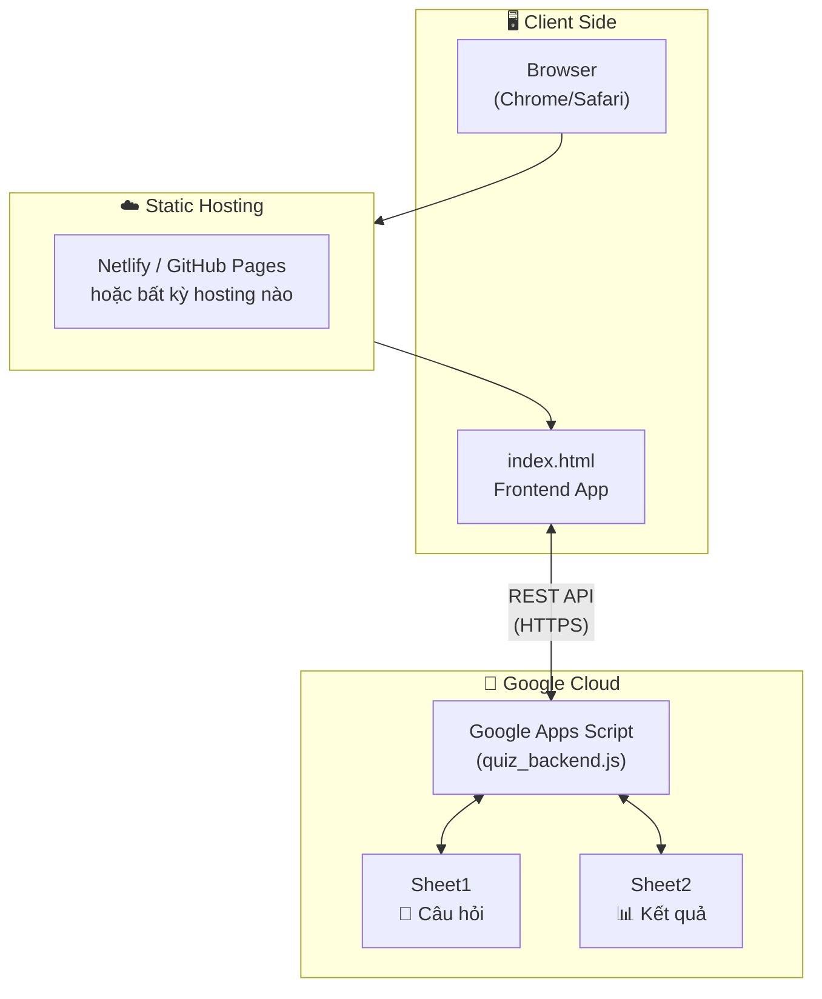
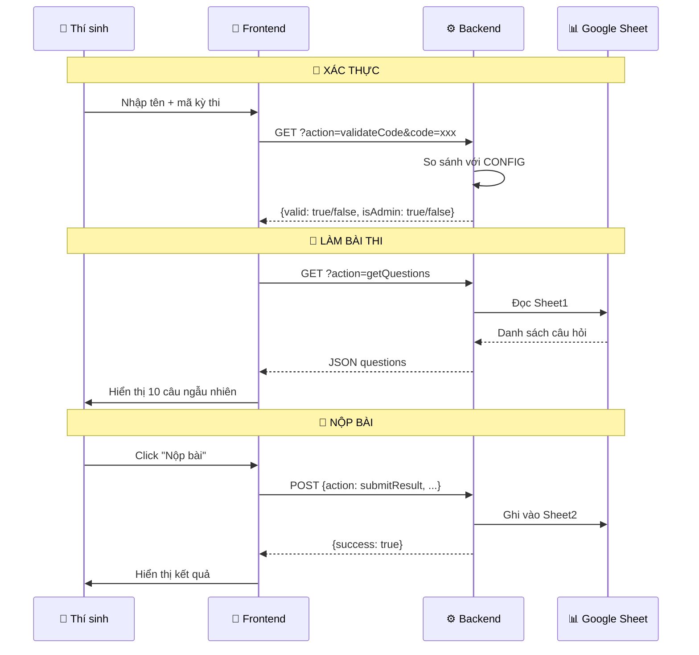
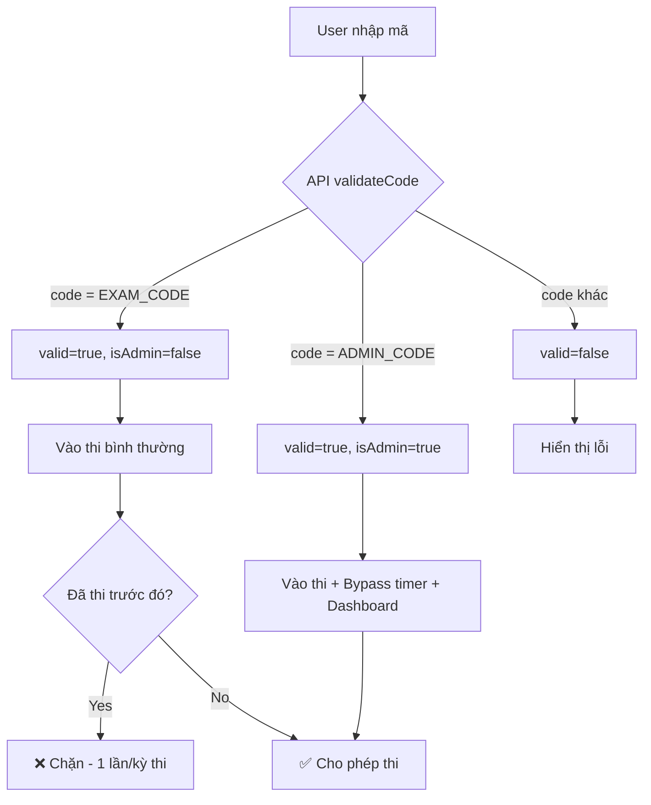
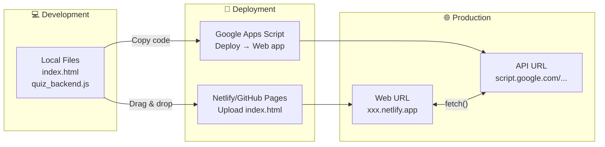
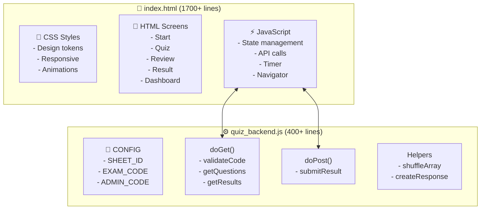

# 📖 ALCV Quiz App - Hướng Dẫn Sử Dụng
# ALCVクイズアプリ - ユーザーガイド

---

## 🎯 Giới thiệu nhanh | クイック紹介

| 🇻🇳 Tiếng Việt | 🇯🇵 日本語 |
|----------------|----------|
| Hệ thống thi trắc nghiệm tự động cho công ty | 企業向け自動クイズシステム |
| Trainer chỉ cần cập nhật câu hỏi trên Google Sheet | トレーナーはGoogle Sheetで問題を更新するだけ |
| Hệ thống tự động tạo đề thi mới | システムが自動的に新しい試験を作成 |

---

## 📁 Cấu trúc file | ファイル構成

```
quiz_app/
├── 📄 index.html          → Giao diện Quiz
├── 📄 quiz_backend.js     → Code Backend (chứa mã bí mật)
├── 📄 sample_questions.csv → Câu hỏi mẫu
└── 📄 ALCV_Quiz_Guideline.md → Tài liệu này
```

---

## 🔐 Bảo mật | セキュリティ

> [!IMPORTANT]
> **Mã kỳ thi và mã admin được lưu AN TOÀN trong file `quiz_backend.js`**
> 
> 試験コードと管理者コードは`quiz_backend.js`に安全に保存されています

### Vị trí cấu hình mã | コード設定場所

| Thông tin | Vị trí | Bảo mật |
|-----------|--------|---------|
| Mã kỳ thi (EXAM_CODE) | `quiz_backend.js` | ✅ Ẩn |
| Mã admin (ADMIN_CODE) | `quiz_backend.js` | ✅ Ẩn |
| Tên kỳ thi (hiển thị) | `index.html` | Công khai |

---

## 📋 Cấu trúc dữ liệu trên Sheet

### Sheet1 - Câu hỏi | 問題

| Cột | Nội dung | Ví dụ |
|-----|----------|-------|
| A | Câu hỏi | "Thủ đô Việt Nam là?" |
| B | Đáp án A | "Hà Nội" |
| C | Đáp án B | "TP.HCM" |
| D | Đáp án C | "Đà Nẵng" |
| E | Đáp án D | "Huế" |
| F | Đáp án đúng | "A" |

> [!TIP]
> Có thể import file `sample_questions.csv` có sẵn để test nhanh!

---

### Sheet2 - Kết quả (tự động tạo) | 結果

| Cột | Nội dung | Mô tả |
|-----|----------|-------|
| A | Timestamp | Thời gian nộp bài |
| B | Tên thí sinh | Họ tên đã nhập |
| C | Số câu đúng | VD: 8 |
| D | Tổng số câu | VD: 10 |
| E | Chi tiết | JSON chi tiết từng câu |

> [!NOTE]
> Sheet2 sẽ được **tự động tạo** khi có thí sinh nộp bài đầu tiên.

---

## 🔄 Khi cần thay đổi mã thi

> [!WARNING]
> **Mỗi lần sửa `quiz_backend.js`, phải deploy lại Apps Script!**

### Các bước:

1. Mở Apps Script Editor (trong Google Sheet)
2. Sửa giá trị trong CONFIG
3. **Ctrl+S** để lưu
4. **Deploy** → **Manage deployments**
5. Click ✏️ (Edit)
6. Version: **New version**
7. **Deploy**

---

## 📊 Manager Dashboard

### Truy cập:
1. Mở trang Quiz
2. Click **"📊 Manager Dashboard"**
3. Nhập **mã admin**
4. Xem thống kê, xuất Excel

### Tính năng:
- 📈 Thống kê: Số đã thi, điểm TB, cao/thấp nhất
- 📊 Biểu đồ phân bố điểm
- 🏆 Top 5 thí sinh
- 📥 Export CSV

---

## ❓ Xử lý sự cố | トラブルシューティング

| Vấn đề | Giải pháp |
|--------|-----------|
| "Mã kỳ thi không chính xác" | Kiểm tra EXAM_CODE trong `quiz_backend.js` |
| Không tải được câu hỏi | Kiểm tra API_URL trong `index.html` |
| Dashboard không vào được | Kiểm tra ADMIN_CODE trong backend |
| Thay đổi không có hiệu lực | Deploy lại Apps Script với **New version** |
| Sheet2 không có dữ liệu | Làm thử 1 bài thi để tạo dữ liệu |

---

## 📞 Hỗ trợ | サポート

Nếu gặp vấn đề, liên hệ đội ngũ kỹ thuật.

問題がある場合は、技術チームにお問い合わせください。

---

## 🏗️ Kiến trúc kỹ thuật | Technical Architecture

> Phần này dành cho đội kỹ thuật để hiểu cấu trúc vận hành hệ thống.

### Tổng quan hạ tầng | Infrastructure Overview



---

### Data Flow - Luồng dữ liệu | データフロー



---

### Authentication Flow - Luồng xác thực



---

### API Endpoints

| Endpoint | Method | Parameters | Response |
|----------|--------|------------|----------|
| `?action=getQuestions` | GET | - | `{success, questions[]}` |
| `?action=getResults` | GET | - | `{success, results[]}` |
| `?action=validateCode` | GET | `code` | `{success, valid, isAdmin}` |
| (body) `action=submitResult` | POST | `name, score, total, details, timestamp` | `{success, name, score, total}` |

---

### Deployment Architecture



---

### Component Diagram



---

### Tech Stack

| Layer | Technology | Purpose |
|-------|------------|---------|
| **Frontend** | HTML5, CSS3, Vanilla JS | UI/UX, không cần framework |
| **Backend** | Google Apps Script | REST API, serverless |
| **Database** | Google Sheets | Lưu trữ câu hỏi + kết quả |
| **Hosting** | Netlify / GitHub Pages | Static file hosting |
| **Auth** | Custom (backend validation) | Xác thực mã kỳ thi |

