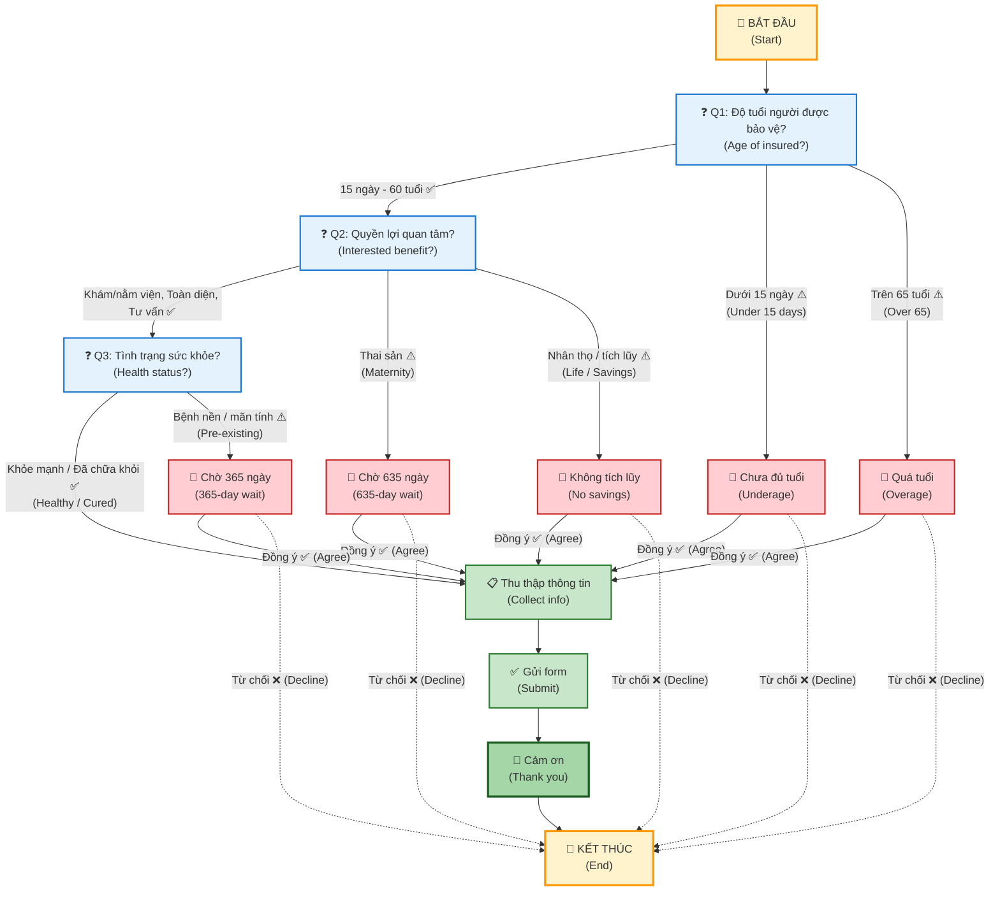
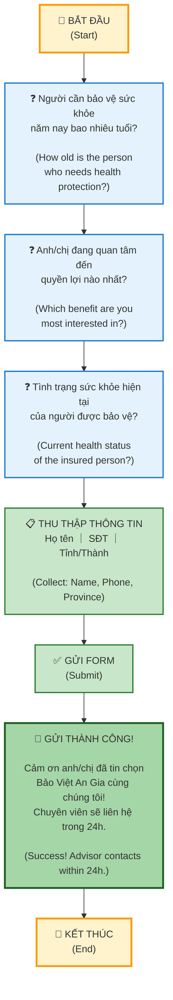
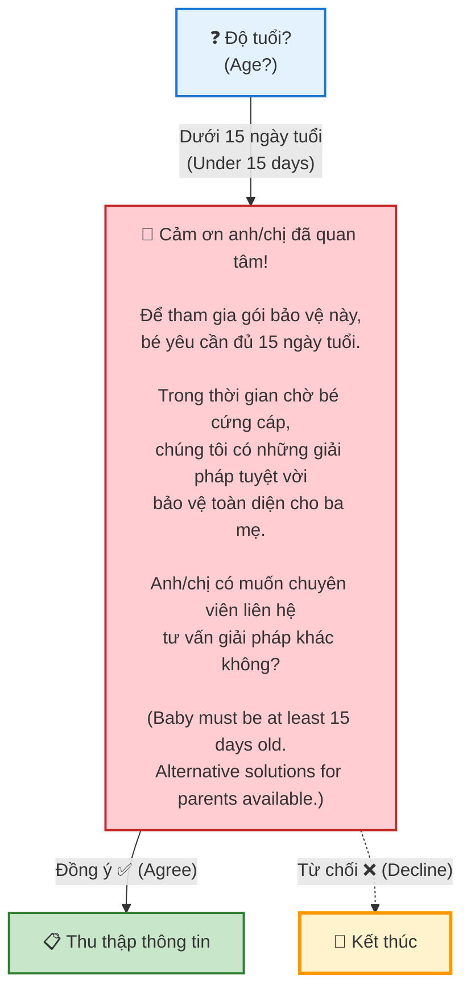
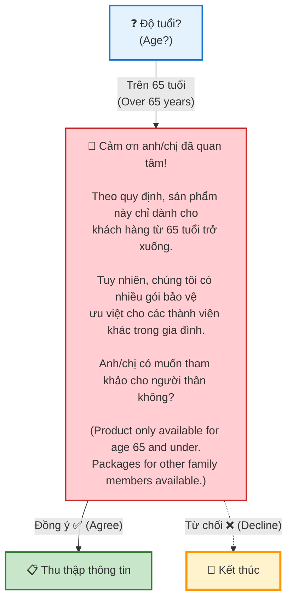
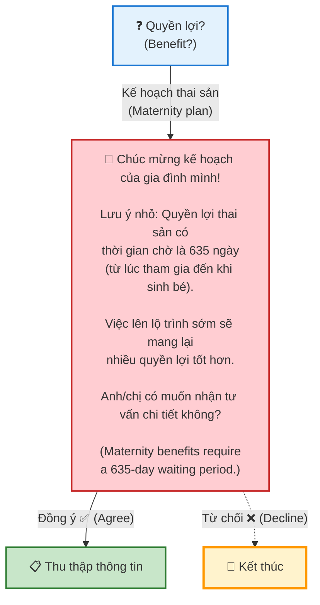
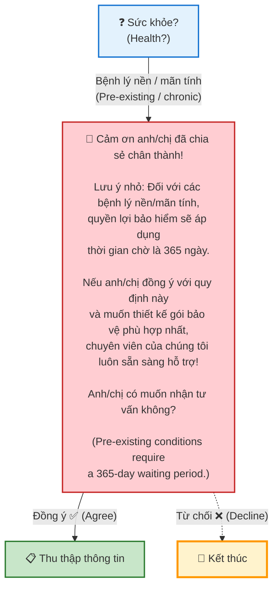
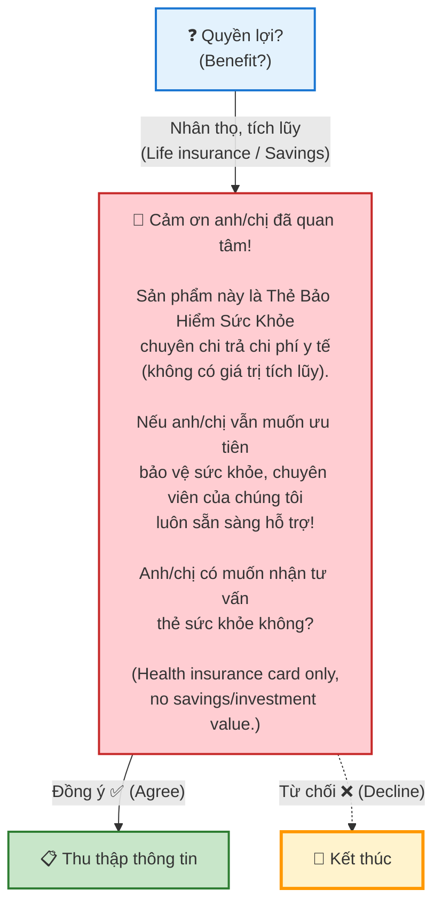

# Conditional Form Workflow

🟢 Xanh lá / Green = Luồng chính (Happy Path)　｜　🔴 Đỏ / Red = Rẽ nhánh điều kiện (Conditional Branch)

---

## 1. Sơ đồ tóm tắt (Summary)

---

## 2. Chi tiết từng bước (Detailed)

### 2.1. Luồng chính (Main Happy Path) 🟢

#### Bảng tuỳ chọn (Options Table):

| Câu hỏi (Question) | Đi tiếp ✅ (Pass) | Rẽ nhánh ⚠️ (Branch) |
|---|---|---|
| **Q1** Độ tuổi (Age) | 15 ngày–10 tuổi, 10–30, 31–50, 51–60 | Dưới 15 ngày → 2.2 ｜ Trên 65 → 2.3 |
| **Q2** Quyền lợi (Benefit) | Khám/nằm viện, Toàn diện, Tư vấn | Thai sản → 2.4 ｜ Nhân thọ/tích lũy → 2.6 |
| **Q3** Sức khỏe (Health) | Khỏe mạnh, Đã chữa khỏi | Bệnh nền/mãn tính → 2.5 |

---

### 2.2. Chưa đủ tuổi (Underage) 🔴

---

### 2.3. Quá tuổi (Overage) 🔴

---

### 2.4. Thai sản (Maternity) 🔴

---

### 2.5. Bệnh nền / mãn tính (Pre-existing Conditions) 🔴

---

### 2.6. Nhân thọ / tích lũy (Life Insurance / Savings) 🔴

