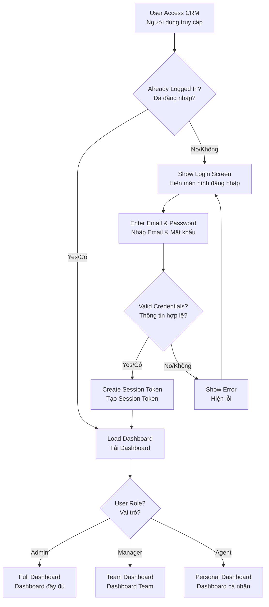
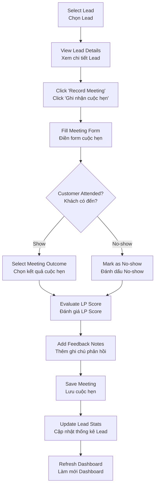
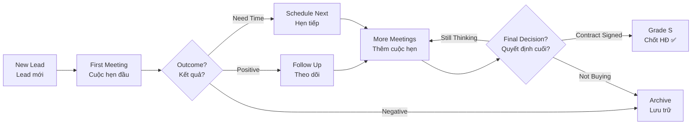
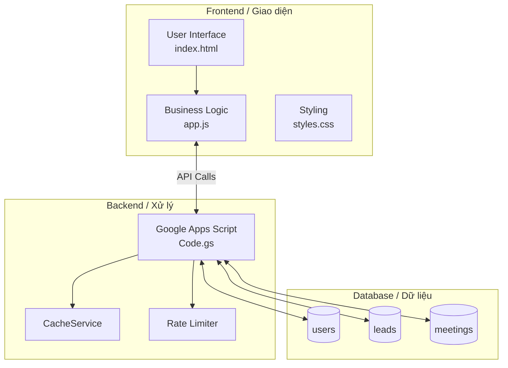
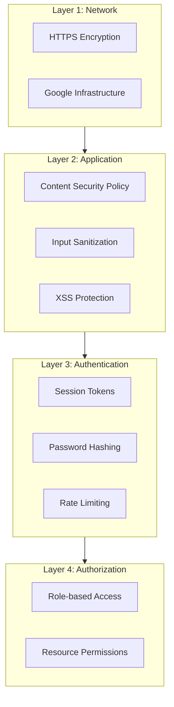

# 📊 Mini CRM - Comprehensive Guideline | Tài Liệu Hướng Dẫn Toàn Diện

<div align="center">


**Lead Management System for Scheduled Appointments**  
**Hệ Thống Quản Lý Leads Đã Có Lịch Hẹn**

*Optimized CRM solution for ALCV Sales Team*  
*Giải pháp CRM tối ưu cho đội ngũ bán hàng ALCV*

</div>

---

## 📋 Table of Contents | Mục Lục

1. [Project Overview | Tổng Quan Dự Án](#1-project-overview--tổng-quan-dự-án)
2. [System Architecture | Kiến Trúc Hệ Thống](#2-system-architecture--kiến-trúc-hệ-thống)
3. [Tech Stack | Công Nghệ Sử Dụng](#3-tech-stack--công-nghệ-sử-dụng)
4. [Key Features | Tính Năng Chính](#4-key-features--tính-năng-chính)
5. [Workflow Diagrams | Sơ Đồ Quy Trình](#5-workflow-diagrams--sơ-đồ-quy-trình)
6. [User Guide | Hướng Dẫn Sử Dụng](#6-user-guide--hướng-dẫn-sử-dụng)
7. [Security | Bảo Mật](#7-security--bảo-mật)
8. [Performance | Hiệu Suất](#8-performance--hiệu-suất)
9. [Operating Costs | Chi Phí Vận Hành](#9-operating-costs--chi-phí-vận-hành)
10. [Current Status | Trạng Thái Hiện Tại](#10-current-status--trạng-thái-hiện-tại)
11. [Support Contact | Thông Tin Hỗ Trợ](#11-support-contact--thông-tin-hỗ-trợ)

---

## 1. Project Overview | Tổng Quan Dự Án

### 1.1 Purpose | Mục Đích

**English:**  
**Mini CRM** is a customer lead management system specifically designed for tracking leads who have scheduled appointments. Built for ALCV's Life Planner (LP) team, the system enables:

- 📊 **Track** progress with each customer
- 📈 **Evaluate** lead quality through LP Score
- 📅 **Record** detailed meeting information
- 📋 **Report** real-time performance metrics

**Tiếng Việt:**  
**Mini CRM** là hệ thống quản lý khách hàng tiềm năng (leads) đã được đặt lịch hẹn, được thiết kế đặc biệt cho đội ngũ Life Planner (LP) của ALCV. Hệ thống giúp:

- 📊 **Theo dõi** tiến độ làm việc với từng khách hàng
- 📈 **Đánh giá** chất lượng leads thông qua LP Score
- 📅 **Ghi nhận** chi tiết từng cuộc hẹn
- 📋 **Báo cáo** hiệu suất theo thời gian thực

### 1.2 User Roles | Đối Tượng Sử Dụng

| Role / Vai Trò | Permissions / Quyền Hạn |
|----------------|-------------------------|
| **Administrator** | Full access: manage users, view all data, export / Toàn quyền: quản lý users, xem tất cả dữ liệu, xuất báo cáo |
| **Manager** | View team data, agent performance reports / Xem dữ liệu team, báo cáo hiệu suất agents |
| **Agent (LP)** | View assigned leads, record meetings / Xem leads được giao, ghi nhận cuộc hẹn |

### 1.3 Key Metrics (KPIs) | Chỉ Số Đo Lường

| Metric / Chỉ Số | Description / Mô Tả | Target / Mục Tiêu |
|-----------------|---------------------|-------------------|
| **LP Score Distribution** | Lead quality distribution (S/A/B/C/D/F) / Phân bố chất lượng leads | - |
| **Meetings per LP** | Average meetings per agent / Trung bình cuộc hẹn mỗi LP | - |
| **Conversion Rate** | Leads converted to contracts / Leads chuyển thành hợp đồng | - |
| **No-show Rate** | Customers who missed appointments / Khách không đến hẹn | - |

---

## 2. System Architecture | Kiến Trúc Hệ Thống

```
┌─────────────────────────────────────────────────────────────────┐
│                   USERS / NGƯỜI DÙNG (Browser)                   │
│                    Chrome / Firefox / Safari                     │
└─────────────────────────────┬───────────────────────────────────┘
                              │ HTTPS
                              ▼
┌─────────────────────────────────────────────────────────────────┐
│                     FRONTEND (Static Files)                      │
│  ┌─────────────┐  ┌─────────────┐  ┌─────────────────────────┐  │
│  │ index.html  │  │ styles.css  │  │        app.js           │  │
│  │   (UI)      │  │  (Styling)  │  │ (Business Logic + API)  │  │
│  └─────────────┘  └─────────────┘  └─────────────────────────┘  │
└─────────────────────────────┬───────────────────────────────────┘
                              │ HTTP GET/POST
                              ▼
┌─────────────────────────────────────────────────────────────────┐
│               BACKEND (Google Apps Script)                       │
│  ┌─────────────────────────────────────────────────────────┐    │
│  │                      Code.gs                              │    │
│  │  • Authentication & Authorization                         │    │
│  │  • CRUD Operations                                        │    │
│  │  • Data Validation & Sanitization                         │    │
│  │  • Rate Limiting & Caching                                │    │
│  └─────────────────────────────────────────────────────────┘    │
└─────────────────────────────┬───────────────────────────────────┘
                              │ SpreadsheetApp API
                              ▼
┌─────────────────────────────────────────────────────────────────┐
│                  DATABASE (Google Sheets)                        │
│  ┌───────────────┐  ┌───────────────┐  ┌───────────────┐        │
│  │    users      │  │     leads     │  │   meetings    │        │
│  │  (Accounts)   │  │  (Customers)  │  │ (Appointments)│        │
│  └───────────────┘  └───────────────┘  └───────────────┘        │
└─────────────────────────────────────────────────────────────────┘
```

### Architecture Benefits | Ưu Điểm Kiến Trúc

| Benefit / Ưu Điểm | Description / Mô Tả |
|-------------------|---------------------|
| **Serverless** | No server management needed, auto-scaling / Không cần quản lý server, tự động scale |
| **Zero Cost** | Completely free within Google quota / Hoàn toàn miễn phí trong giới hạn quota |
| **Auto Backup** | Google automatically backs up Sheets / Google tự động backup dữ liệu |
| **Familiar Interface** | Team can view/edit directly in Sheets / Team có thể xem/chỉnh trực tiếp trong Sheets |
| **Rapid Development** | Deploy in minutes / Deploy trong vài phút |

---

## 3. Tech Stack | Công Nghệ Sử Dụng

### 3.1 Frontend

| Technology / Công Nghệ | Version | Purpose / Mục Đích |
|------------------------|---------|---------------------|
| **HTML5** | - | UI structure / Cấu trúc giao diện |
| **CSS3** | - | Styling, animations, responsive design |
| **JavaScript (ES6+)** | - | Business logic, API calls |
| **Chart.js** | 4.4.1 | LP Score & Agent Performance charts / Biểu đồ |
| **Chart.js DataLabels** | 2.2.0 | Chart label plugin |
| **Font Awesome** | 6.0.0 | Icons |
| **Google Fonts (Inter)** | - | Typography |

### 3.2 Backend

| Technology / Công Nghệ | Purpose / Mục Đích |
|------------------------|---------------------|
| **Google Apps Script (GAS)** | REST API, Business Logic |
| **CacheService** | Server-side caching (5 min / phút) |
| **LockService** | Concurrency control / Kiểm soát đồng thời |
| **ContentService** | JSON response handling |

### 3.3 Database

| Technology / Công Nghệ | Purpose / Mục Đích |
|------------------------|---------------------|
| **Google Sheets** | NoSQL-like data storage / Lưu trữ dữ liệu |
| **SpreadsheetApp API** | CRUD operations / Thao tác dữ liệu |

### 3.4 Security | Bảo Mật

| Feature / Tính Năng | Method / Phương Pháp |
|---------------------|----------------------|
| **Authentication** | Session token + localStorage |
| **Password Security** | SHA-256 hashing (optional) |
| **Input Sanitization** | XSS, SQL Injection protection / Chống XSS, SQL Injection |
| **Rate Limiting** | 60 requests/minute per user / 60 request/phút mỗi user |
| **CSP Headers** | Content Security Policy |
| **Session Management** | Auto-timeout 20 min idle / Tự động hết hạn sau 20 phút |

### 3.5 Performance Optimizations | Tối Ưu Hiệu Suất

| Optimization / Tối Ưu | Description / Mô Tả |
|-----------------------|---------------------|
| **Request Caching** | 30s cache for API calls / Cache 30s cho API |
| **Debounced Search** | 150ms delay when typing / Delay 150ms khi gõ |
| **Batch DOM Rendering** | requestAnimationFrame for table |
| **GPU Acceleration** | will-change, translateZ for animations |
| **Lazy Loading** | Charts load on demand / Charts chỉ load khi cần |

---

## 4. Key Features | Tính Năng Chính

### 4.1 Dashboard Overview | Tổng Quan Dashboard

```
┌────────────────────────────────────────────────────────────┐
│  [S:2] [A:5] [B:10] [C:15] [D:8] [F:5]    45 leads         │
│                                                             │
│  ┌─────────────────┐  ┌─────────────────────────────────┐  │
│  │ 📊 LP Score      │  │  🏆 Agent Performance           │  │
│  │    [Chart]       │  │     [Bar Chart]                 │  │
│  └─────────────────┘  └─────────────────────────────────┘  │
│                                                             │
│  ┌─────────────────────────────────────────────────────┐   │
│  │ 📋 Leads List / Danh sách Leads      [Search] [Filter]│ │
│  │ ─────────────────────────────────────────────────────── │
│  │ Customer    | Stage          | Meetings | LP Score     │ │
│  │ Nguyễn A    | Thinking more  | 3        | B            │ │
│  │ ...                                                      │ │
│  └─────────────────────────────────────────────────────┘   │
└────────────────────────────────────────────────────────────┘
```

### 4.2 LP Score System | Hệ Thống Đánh Giá LP Score

| Grade | Color / Màu | Meaning / Ý Nghĩa | Action / Hành Động |
|-------|-------------|-------------------|---------------------|
| **S** | 🟡 Gold | Customer already closed contract / Khách đã chốt hợp đồng | Archive as success / Lưu trữ thành công |
| **A** | 🟢 Green | High potential / Tiềm năng cao | Follow up immediately / Follow up ngay |
| **B** | 🔵 Blue | Interested / Quan tâm | Nurturing |
| **C** | 🟠 Orange | Needs more time / Cần thêm thời gian | Periodic reminders / Nhắc nhở định kỳ |
| **D** | 🔴 Red | Low potential / Ít tiềm năng | Lower priority / Giảm ưu tiên |
| **F** | ⚫ Gray | Not suitable / Không phù hợp | Archive / Lưu trữ |

### 4.3 Meeting Outcomes | Kết Quả Cuộc Hẹn (10 Stages)

| # | English | Tiếng Việt | System Code |
|---|---------|------------|-------------|
| 1 | Contract Signed | Chốt hợp đồng | `chot_hd` |
| 2 | Not Interested | Không muốn mua | `khong_muon_mua` |
| 3 | Needs to Think | Suy nghĩ thêm | `suy_nghi_them` |
| 4 | No Budget | Không có tiền | `khong_co_tien` |
| 5 | Wants Health Insurance | Muốn mua BH Sức Khỏe | `muon_mua_sk` |
| 6 | Bought from Competitor | Đã mua của Cty khác | `da_mua_cty_khac` |
| 7 | Other Reason | Lý do khác | `ly_do_khac` |
| 8 | Postponed by Asahi | Tạm hoãn bởi Asahi | `tam_hoan_asahi` |
| 9 | Customer Sells Insurance | KH cũng bán bảo hiểm | `kh_ban_bh` |
| 10 | Customer No-show | Khách hàng No-show | `no_show` |

### 4.4 Export & Reporting | Xuất Báo Cáo

- **Export All:** Export all leads + meetings data / Xuất toàn bộ dữ liệu
- **Filter by Date:** Filter by date range / Lọc theo khoảng thời gian
- **Filter by Agent:** Filter by assigned LP / Lọc theo LP phụ trách
- **Format:** Excel-compatible CSV

---

## 5. Workflow Diagrams | Sơ Đồ Quy Trình

### 5.1 User Authentication Flow | Quy Trình Đăng Nhập



### 5.2 Meeting Recording Flow | Quy Trình Ghi Nhận Cuộc Hẹn



### 5.3 Lead Lifecycle | Vòng Đời Lead



### 5.4 Data Flow Architecture | Luồng Dữ Liệu



---

## 6. User Guide | Hướng Dẫn Sử Dụng

### 6.1 Login | Đăng Nhập

**English:**
1. Access the Mini CRM URL
2. Enter **Email** and **Password**
3. Click **"Login"**

**Tiếng Việt:**
1. Truy cập URL của Mini CRM
2. Nhập **Email** và **Mật khẩu**
3. Click **"Đăng nhập"**

> 💡 Session expires after 24 hours or 20 minutes of inactivity  
> 💡 Session tự động hết hạn sau 24 giờ hoặc 20 phút không hoạt động

### 6.2 Recording a Meeting | Ghi Nhận Cuộc Hẹn

**English:**
1. Click on a lead in the table → Detail panel opens
2. Click **"Record New Meeting"**
3. Fill in:
   - Date/time
   - Attendance (Show/No-show)
   - Purpose
   - Outcome (select 1 of 10 stages)
   - New LP Score
   - Customer feedback
4. Click **"Save Meeting"**

**Tiếng Việt:**
1. Click vào một lead trong bảng → Panel chi tiết mở ra
2. Click **"Ghi nhận cuộc hẹn mới"**
3. Điền thông tin:
   - Ngày/giờ hẹn
   - Khách có đến không (Show/No-show)
   - Mục đích cuộc hẹn
   - Kết quả (chọn 1 trong 10 stages)
   - LP Score mới
   - Phản hồi của khách
4. Click **"Lưu cuộc hẹn"**

### 6.3 Search & Filter | Tìm Kiếm & Lọc

- **Search Box:** Type lead name or code / Gõ tên hoặc mã lead
- **Stage Filter:** Filter by status (10 options) / Lọc theo trạng thái
- **Combined:** Search + Filter work together / Search + Filter hoạt động cùng lúc

---

## 7. Security | Bảo Mật

### 7.1 Security Layers | Các Lớp Bảo Vệ




---

## 8. Performance | Hiệu Suất

### 8.1 Benchmarks

| Metric / Chỉ Số | Value / Giá Trị | Condition / Điều Kiện |
|-----------------|-----------------|------------------------|
| **First Load** | < 2s | Stable 4G network / Mạng 4G ổn định |
| **API Response** | < 500ms | Cached data |
| **Table Render** | < 100ms | 100 leads |
| **Search** | Realtime | Debounced 150ms |

### 8.2 Limits | Giới Hạn

| Resource / Tài Nguyên | Limit / Giới Hạn | Note / Ghi Chú |
|-----------------------|------------------|----------------|
| **Google Apps Script** | 6 min/execution | Sufficient for normal ops / Đủ cho thao tác thông thường |
| **Spreadsheet** | 10M cells | ~100,000 leads |
| **API Calls** | 20,000/day | Sufficient for 50 users / Đủ cho 50 người |
| **Concurrent Users** | ~50 | Can increase with caching / Có thể tăng với caching |

---

## 9. Operating Costs | Chi Phí Vận Hành

### 9.1 Direct Costs | Chi Phí Trực Tiếp

| Item / Hạng Mục | Cost / Chi Phí | Note / Ghi Chú |
|-----------------|----------------|----------------|
| Google Workspace | $0 - $12/user/month | If already subscribed: $0 / Nếu đã có: $0 |
| Hosting | $0 | Google Apps Script free / miễn phí |
| Database | $0 | Google Sheets free / miễn phí |
| SSL Certificate | $0 | Included |
| **TOTAL** | **$0/month** | With existing Google Account / Với tài khoản Google có sẵn |

### 9.2 Comparison | So Sánh

| Solution / Giải Pháp | Cost/User/Month | Features / Tính Năng |
|----------------------|-----------------|----------------------|
| **Mini CRM** | $0 | Custom-built for ALCV / Thiết kế riêng cho ALCV |
| Salesforce | $25-300 | Enterprise features |
| HubSpot CRM | $0-50 | Marketing focus |
| Zoho CRM | $12-45 | General purpose |

---

## 10. Current Status | Trạng Thái Hiện Tại

### Pilot Version | Phiên Bản Thử Nghiệm

**English:**  
Mini CRM is currently in **pilot testing phase**. The system is being refined based on real-world usage and feedback from the LP team. Future enhancements will be planned based on pilot results and business requirements.

**Tiếng Việt:**  
Mini CRM hiện đang trong **giai đoạn thử nghiệm pilot**. Hệ thống đang được hoàn thiện dựa trên việc sử dụng thực tế và phản hồi từ đội ngũ LP. Các tính năng nâng cao sẽ được lên kế hoạch dựa trên kết quả pilot và yêu cầu kinh doanh.

---

## 11. Support Contact | Thông Tin Hỗ Trợ

For technical support or feature requests, please contact:  
Để được hỗ trợ kỹ thuật hoặc yêu cầu tính năng, vui lòng liên hệ:

Hieu Le ALCV.

---

**© 2026 Hieu Le - ALCV | Open Source Project**

*Pilot Version 2.0.0 | Phiên bản thử nghiệm 2.0.0*

</div>


