# 🏛 Mini CRM — System Architecture
# 🏛 Mini CRM — Kiến Trúc Hệ Thống

> **Version:** 3.0 (Firebase Mode)  
> **Last Updated:** 2026-06-03  

---

## Table of Contents / Mục Lục

1. [High-Level Architecture / Tổng Quan Kiến Trúc](#1-high-level-architecture--tổng-quan-kiến-trúc)
2. [Tech Stack / Công Nghệ Sử Dụng](#2-tech-stack--công-nghệ-sử-dụng)
3. [Project File Structure / Cấu Trúc File Dự Án](#3-project-file-structure--cấu-trúc-file-dự-án)
4. [Data Models / Mô Hình Dữ Liệu](#4-data-models--mô-hình-dữ-liệu)
5. [Authentication Workflow / Luồng Xác Thực](#5-authentication-workflow--luồng-xác-thực)
6. [RBAC & Data Scoping / Phân Quyền & Phạm Vi Dữ Liệu](#6-rbac--data-scoping--phân-quyền--phạm-vi-dữ-liệu)
7. [Core Business Workflows / Luồng Nghiệp Vụ Chính](#7-core-business-workflows--luồng-nghiệp-vụ-chính)
8. [Security Architecture / Kiến Trúc Bảo Mật](#8-security-architecture--kiến-trúc-bảo-mật)
9. [Deployment Architecture / Kiến Trúc Triển Khai](#9-deployment-architecture--kiến-trúc-triển-khai)
10. [Dual Backend System / Hệ Thống Hai Backend](#10-dual-backend-system--hệ-thống-hai-backend)
11. [DevOps & Tooling / Công Cụ Vận Hành](#11-devops--tooling--công-cụ-vận-hành)
12. [Cost Analysis / Phân Tích Chi Phí](#12-cost-analysis--phân-tích-chi-phí)

---

## 1. High-Level Architecture / Tổng Quan Kiến Trúc

The system follows a **Serverless SPA** (Single Page Application) pattern. The frontend is a static web app deployed to Firebase Hosting. The backend runs on Firebase's managed services (Authentication, Firestore, Cloud Functions) with a fallback path to Google Apps Script + Google Sheets.

Hệ thống theo mô hình **SPA không cần server** (Serverless Single Page Application). Frontend là web app tĩnh, deploy trên Firebase Hosting. Backend chạy trên các dịch vụ được Google quản lý sẵn (Firebase Authentication, Firestore, Cloud Functions) với đường dự phòng sang Google Apps Script + Google Sheets.

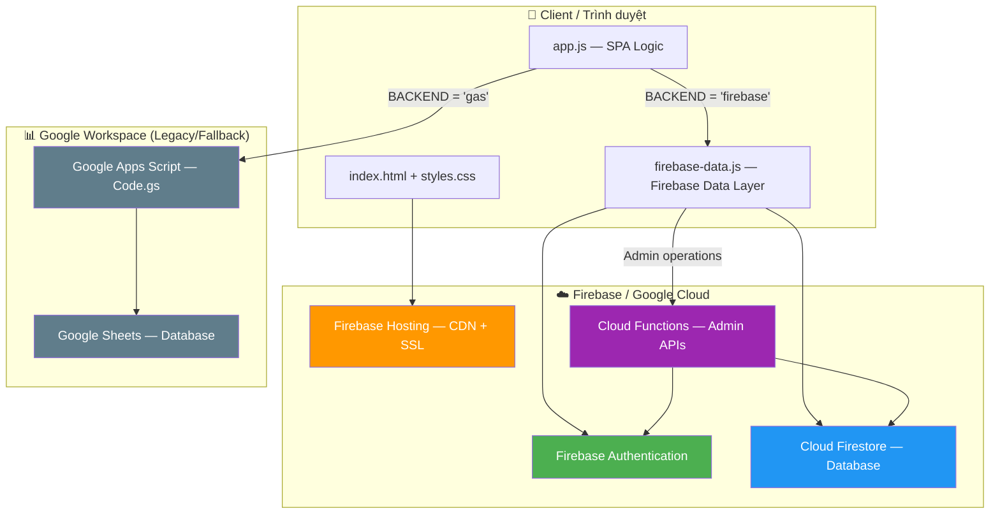

> **Current mode / Chế độ hiện tại:** `API_CONFIG.BACKEND = 'firebase'`  
> The system is running on **full Firebase** — Auth, Firestore, and Cloud Functions are all active. The GAS + Sheets backend exists as a fallback codebase.  
> Hệ thống đang chạy **toàn bộ trên Firebase** — Auth, Firestore, và Cloud Functions đều đang hoạt động. Backend GAS + Sheets tồn tại như code dự phòng.

---

## 2. Tech Stack / Công Nghệ Sử Dụng

### 2.1 Frontend

| Technology / Công nghệ | Version | Purpose / Mục đích |
|---|---|---|
| **HTML5** | — | Page structure / Cấu trúc trang |
| **CSS3** (Vanilla) | — | Styling, responsive design, dark theme / Giao diện, responsive, giao diện tối |
| **JavaScript** (ES6+) | — | SPA logic, DOM manipulation / Logic SPA, thao tác DOM |
| **Chart.js** | 4.4.1 | LP Score distribution charts, Agent performance bars / Biểu đồ phân bố LP Score, hiệu suất Agent |
| **chartjs-plugin-datalabels** | 2.x | Data labels on chart bars / Nhãn dữ liệu trên biểu đồ |
| **Firebase JS SDK** (compat) | 10.14.1 | Auth, Firestore, Functions client / SDK phía client |
| **Google Fonts — Inter** | 300–700 | Typography / Phông chữ |

### 2.2 Backend (Firebase — Active / Đang Sử Dụng)

| Service / Dịch vụ | Purpose / Mục đích |
|---|---|
| **Firebase Authentication** | User login (email/password), password hashing (scrypt), account disable/enable / Đăng nhập, băm mật khẩu, bật/tắt tài khoản |
| **Cloud Firestore** | NoSQL document database for `users` and `leads` collections / Cơ sở dữ liệu NoSQL cho collections `users` và `leads` |
| **Firestore Security Rules** | Database-level RBAC enforcement / Phân quyền cấp DB |
| **Cloud Functions v2** (Node.js 20) | Admin-only callable functions: create/update/delete users, bulk import, auto-sync Custom Claims / Hàm admin: tạo/sửa/xoá user, nhập hàng loạt, tự động đồng bộ Custom Claims |
| **Firebase Hosting** | Static file serving with CDN, SSL, security headers / Phân phối file tĩnh với CDN, SSL, security headers |

### 2.3 Backend (GAS — Legacy Fallback / Dự Phòng)

| Technology / Công nghệ | Purpose / Mục đích |
|---|---|
| **Google Apps Script** | REST-like API via `doGet()`/`doPost()` Web App / API dạng REST |
| **Google Sheets** | Flat-file database (2 sheets: `users`, `leads`) / Cơ sở dữ liệu dạng bảng tính |
| **CacheService** | Server-side caching (5 min TTL) / Cache phía server |
| **LockService** | Mutex for concurrent writes / Khóa chống ghi đồng thời |

### 2.4 DevOps & Tooling

| Tool / Công cụ | Purpose / Mục đích |
|---|---|
| **Firebase CLI** | Deploy hosting, functions, rules, indexes / Triển khai |
| **Node.js scripts** (`tools/`) | Data migration, password setup, appointment sync / Chuyển dữ liệu, thiết lập mật khẩu |
| **firebase-admin SDK** | Server-side Firebase operations in migration scripts / Thao tác Firebase phía server |

---

## 3. Project File Structure / Cấu Trúc File Dự Án

```
mini_crm/
├── index.html              # Main SPA entry point / Trang chính SPA
├── styles.css              # All styles (~63KB) / Toàn bộ CSS
├── app.js                  # Main application logic (~133KB, 3273 lines) / Logic ứng dụng chính
├── firebase-config.js      # Firebase project credentials (public) / Thông tin Firebase (công khai)
├── firebase-data.js        # Firebase data layer (window.CRM) / Tầng dữ liệu Firebase
├── firebase.json           # Hosting config, CSP headers, Firestore/Functions setup
├── firestore.rules         # Firestore Security Rules (RBAC) / Luật bảo mật Firestore
├── firestore.indexes.json  # Composite indexes / Index kết hợp
├── .firebaserc             # Firebase project alias
│
├── Code.gs                 # Google Apps Script backend (legacy) / Backend GAS (dự phòng)
│
├── functions/
│   ├── index.js            # Cloud Functions: syncUserClaims, admin CRUD / Hàm Cloud
│   └── package.json        # Dependencies: firebase-admin, firebase-functions
│
├── tools/
│   ├── migrate-sheets-to-firestore.js  # Migrate data from Sheets → Firestore
│   ├── set-unique-passwords.js         # Set unique passwords for each user
│   ├── import-appointment.js           # Import appointment data
│   ├── sync-appointment-from-sheet.js  # Sync appointments from Google Sheets
│   ├── serviceAccountKey.json          # Firebase Admin SDK key (PRIVATE!)
│   └── data/                           # Source data files for import
│
├── apps-script/            # Additional GAS modules
├── Mini CRM Database.xlsx  # Original data source / Dữ liệu gốc
└── *.md                    # Documentation / Tài liệu
```

---

## 4. Data Models / Mô Hình Dữ Liệu

### 4.1 Entity Relationship / Quan Hệ Thực Thể

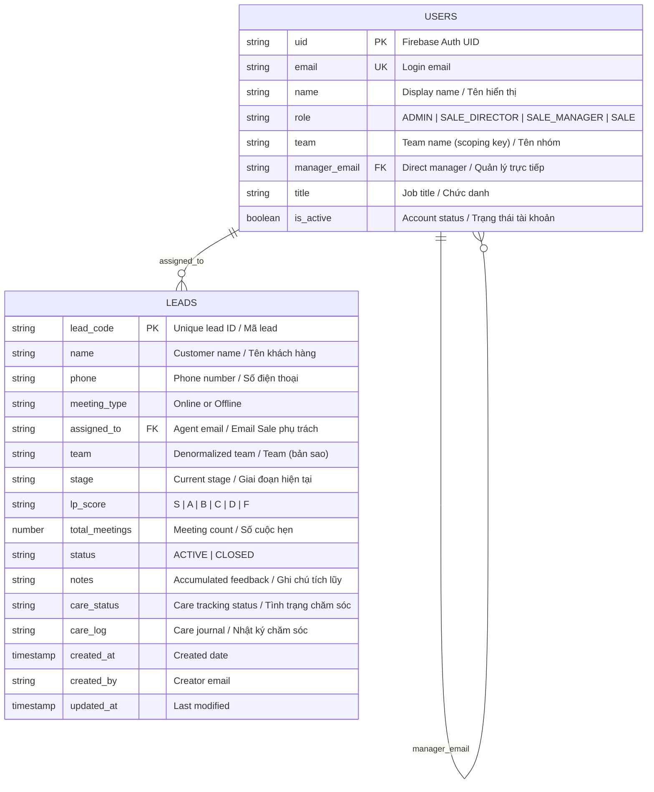

### 4.2 LP Score System / Hệ Thống Đánh Giá LP Score

| Grade | Meaning / Ý nghĩa | Color / Màu |
|---|---|---|
| **S** | Success — Closed deal / Chốt hợp đồng | 🟡 Gold |
| **A** | Hot — Very likely to close / Rất tiềm năng | 🟢 Dark Green |
| **B** | Warm — Good potential / Tiềm năng tốt | 🟢 Green |
| **C** | Neutral — Needs nurturing / Cần chăm sóc thêm | 🟡 Yellow |
| **D** | Cool — Low interest / Ít quan tâm | 🟠 Orange |
| **F** | Failed — Not interested / Không quan tâm | 🔴 Red |

### 4.3 Lead Stage Values / Các Giai Đoạn Lead

| Stage Code | Vietnamese Label |
|---|---|
| `chot_hd` | Chốt hợp đồng |
| `khong_muon_mua` | Không muốn mua |
| `suy_nghi_them` | Suy nghĩ thêm |
| `khong_co_tien` | Không có tiền |
| `muon_mua_sk` | Muốn mua BH Sức Khỏe |
| `da_mua_cty_khac` | Đã mua của Cty khác |
| `ly_do_khac` | Lý do khác |
| `tam_hoan_asahi` | Tạm hoãn bởi Asahi |
| `kh_ban_bh` | KH cũng bán bảo hiểm |
| `no_show` | Khách hàng No-show |

### 4.4 Care Status / Tình Trạng Chăm Sóc

| Value | Label | Icon | Active? |
|---|---|---|---|
| `chua_lien_he` | Chưa liên hệ | ⚪ | No |
| `dang_lien_he_zalo` | Đang trao đổi Zalo | 💬 | Yes |
| `dang_goi_dien` | Đang gọi điện | 📞 | Yes |
| `cho_phan_hoi` | Chờ khách phản hồi | ⏳ | Yes |
| `da_hen_gap` | Đã hẹn gặp | 📅 | Yes |
| `dang_cham_soc` | Đang chăm sóc | 🤝 | Yes |
| `tam_dung` | Tạm dừng chăm sóc | ⏸️ | No |
| `khong_quan_tam` | Không quan tâm | 🚫 | No |

---

## 5. Authentication Workflow / Luồng Xác Thực

### 5.1 Firebase Mode (Active / Đang Dùng)

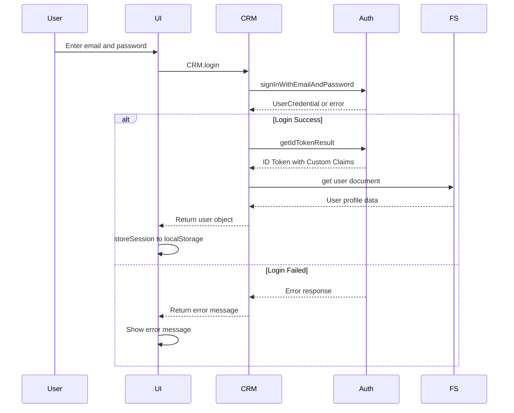

**How Custom Claims work / Cách Custom Claims hoạt động:**
- When an Admin creates or updates a user → Cloud Function `adminCreateUser`/`adminUpdateUser` writes to the `users/{uid}` document in Firestore.
- The `syncUserClaims` trigger (Firestore `onDocumentWritten`) automatically copies `role` and `team` from the document into the user's Firebase Auth Custom Claims.
- On next login or token refresh, the ID token contains `{role, team}` — no extra database read needed.
- Firestore Security Rules read these claims to enforce access control at the database level.

- Khi Admin tạo hoặc cập nhật user → Cloud Function `adminCreateUser`/`adminUpdateUser` ghi vào document `users/{uid}` trong Firestore.
- Trigger `syncUserClaims` (Firestore `onDocumentWritten`) tự động sao chép `role` và `team` từ document vào Custom Claims của Firebase Auth.
- Lần đăng nhập hoặc refresh token tiếp theo, ID token sẽ chứa `{role, team}` — không cần đọc DB thêm.
- Firestore Security Rules đọc các claim này để kiểm soát quyền truy cập ở cấp database.

### 5.2 Session Management (Client-side)

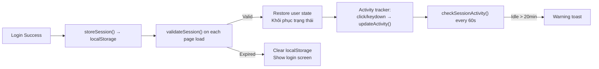

---

## 6. RBAC & Data Scoping / Phân Quyền & Phạm Vi Dữ Liệu

### 6.1 Role Hierarchy / Phân Cấp Vai Trò

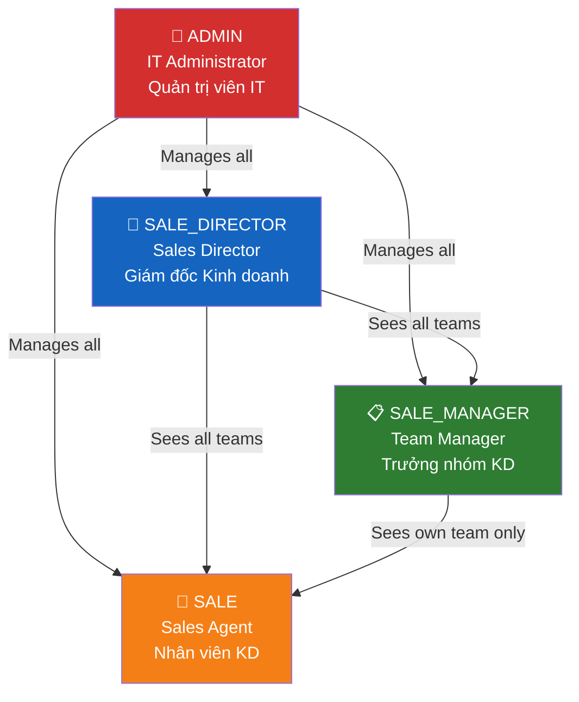

### 6.2 Permission Matrix / Ma Trận Quyền

| Capability / Quyền | ADMIN | SALE_DIRECTOR | SALE_MANAGER | SALE |
|---|:---:|:---:|:---:|:---:|
| **View leads / Xem leads** | All / Tất cả | All / Tất cả | Own team only / Chỉ team mình | Own leads only / Chỉ lead của mình |
| **Update lead data** | ✅ | ✅ | ✅ (team) | ✅ (own, can't change `assigned_to`) |
| **Assign/reassign leads** | ✅ Any | ✅ Any | ✅ Within team / Trong team | ❌ |
| **Record meetings / Ghi nhận cuộc hẹn** | ✅ | ✅ | ✅ (team) | ✅ (own) |
| **Create/delete users** | ✅ | ✅ (not ADMIN/DIRECTOR roles) | ❌ | ❌ |
| **View user list** | All | All | Own team | Self only |
| **Export data / Xuất dữ liệu** | ✅ All | ✅ All | ✅ Team scope | ✅ Own scope |
| **View dashboard charts** | ✅ All data | ✅ All data | ✅ Team data | ❌ |

### 6.3 Data Scoping Logic / Logic Phạm Vi Dữ Liệu

The scoping is enforced at **two layers** — once in the Firestore Security Rules (server-enforced, cannot be bypassed), and again in `firebase-data.js` via query construction:

Phạm vi được thực thi ở **hai tầng** — một lần trong Firestore Security Rules (server-enforced, không thể bypass), và một lần nữa trong `firebase-data.js` qua cách xây dựng query:

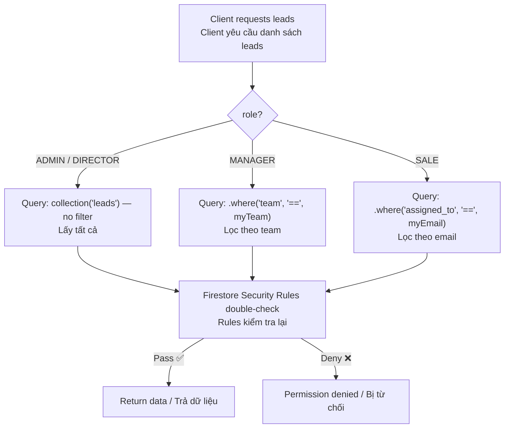

---

## 7. Core Business Workflows / Luồng Nghiệp Vụ Chính

### 7.1 Lead Lifecycle / Vòng Đời Lead

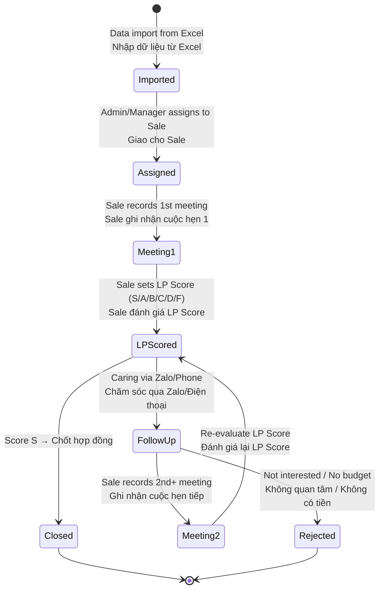

### 7.2 Meeting Recording Workflow / Luồng Ghi Nhận Cuộc Hẹn

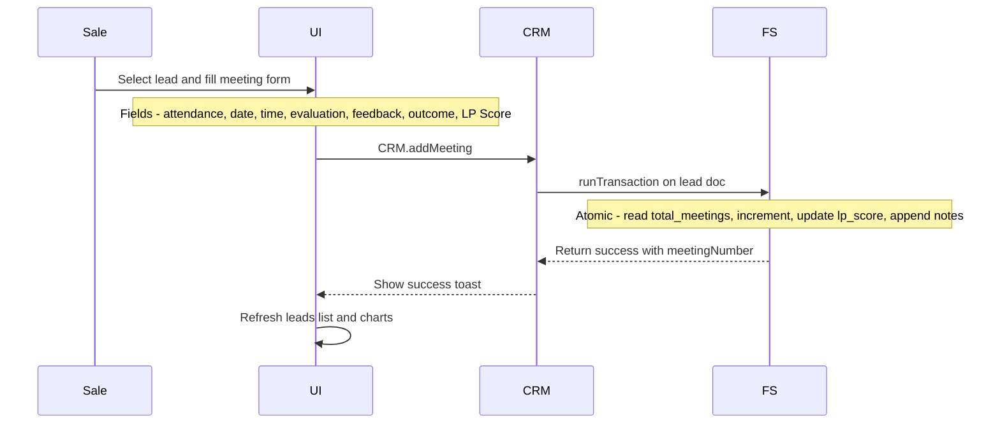

### 7.3 User Management Workflow / Luồng Quản Lý User

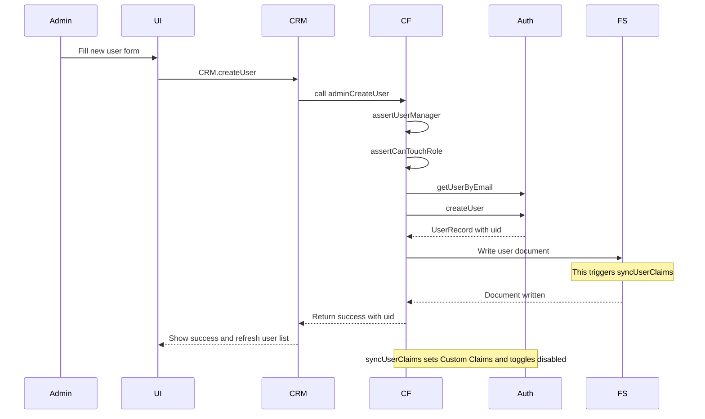

---

## 8. Security Architecture / Kiến Trúc Bảo Mật

### 8.1 Defense Layers / Các Tầng Phòng Thủ

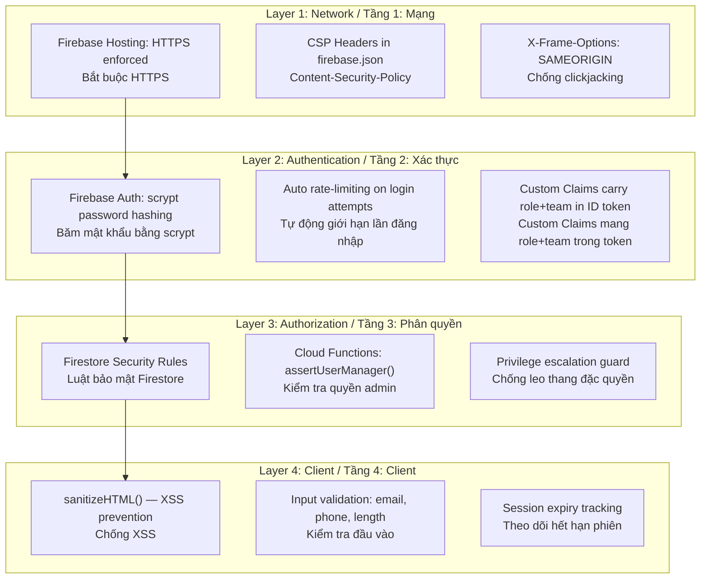

### 8.2 Firestore Security Rules (Simplified) / Luật Bảo Mật Firestore

```
leads/{code}:
  READ  → Admin/Director: ALL
        → Manager: WHERE lead.team == my_team
        → Sale: WHERE lead.assigned_to == my_email

  WRITE → Admin/Director: ALL
        → Manager: WHERE lead.team == my_team
        → Sale: own leads only, CANNOT change assigned_to or team

users/{uid}:
  READ  → Admin/Director: ALL
        → Manager: same team only
        → Sale: self only
  WRITE → Admin/Director only
```

### 8.3 Privilege Escalation Guard / Chống Leo Thang Đặc Quyền

The Cloud Functions implement a guard (`assertCanTouchRole`) that prevents SALE_DIRECTOR from creating, modifying, or deleting accounts with privileged roles (ADMIN, SALE_DIRECTOR). Only ADMIN can touch those roles.

Cloud Functions triển khai bộ chặn (`assertCanTouchRole`) ngăn SALE_DIRECTOR tạo, sửa, hoặc xoá tài khoản có vai trò đặc quyền (ADMIN, SALE_DIRECTOR). Chỉ ADMIN mới được phép thao tác với các vai trò này.

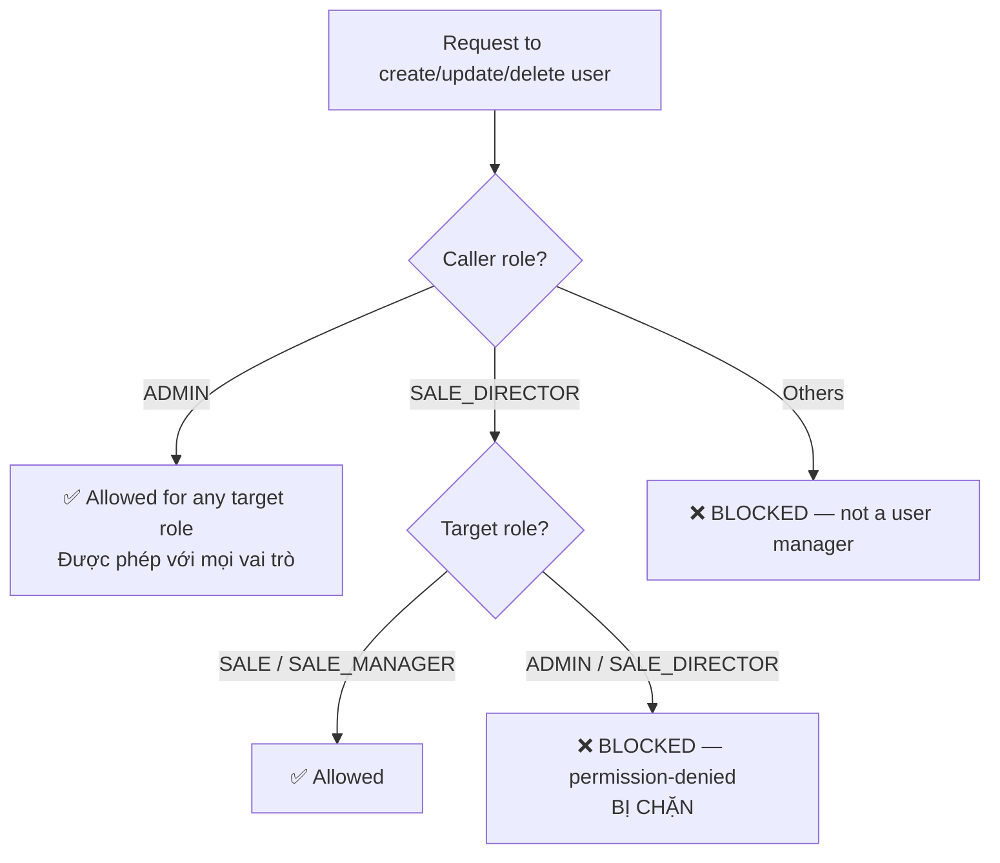

---

## 9. Deployment Architecture / Kiến Trúc Triển Khai

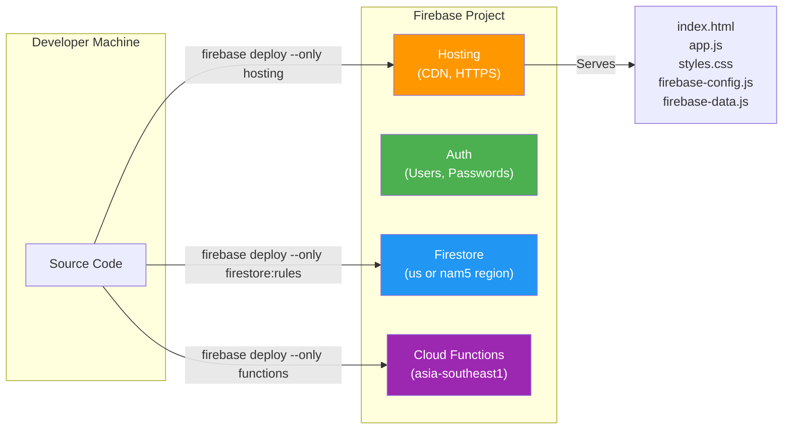

**Deployed files (Hosting):** Only `index.html`, `app.js`, `styles.css`, `firebase-config.js`, `firebase-data.js` are deployed. All `.md`, `.gs`, `.json` config, `functions/`, `tools/` are excluded by `firebase.json` ignore rules.

**File được deploy (Hosting):** Chỉ `index.html`, `app.js`, `styles.css`, `firebase-config.js`, `firebase-data.js` được triển khai. Tất cả `.md`, `.gs`, `.json` config, `functions/`, `tools/` đều bị loại trừ bởi quy tắc ignore trong `firebase.json`.

---

## 10. Dual Backend System / Hệ Thống Hai Backend

The codebase contains **two complete backend implementations**. The active backend is selected by `API_CONFIG.BACKEND` in `app.js`:

Codebase chứa **hai bộ backend hoàn chỉnh**. Backend đang hoạt động được chọn bởi `API_CONFIG.BACKEND` trong `app.js`:

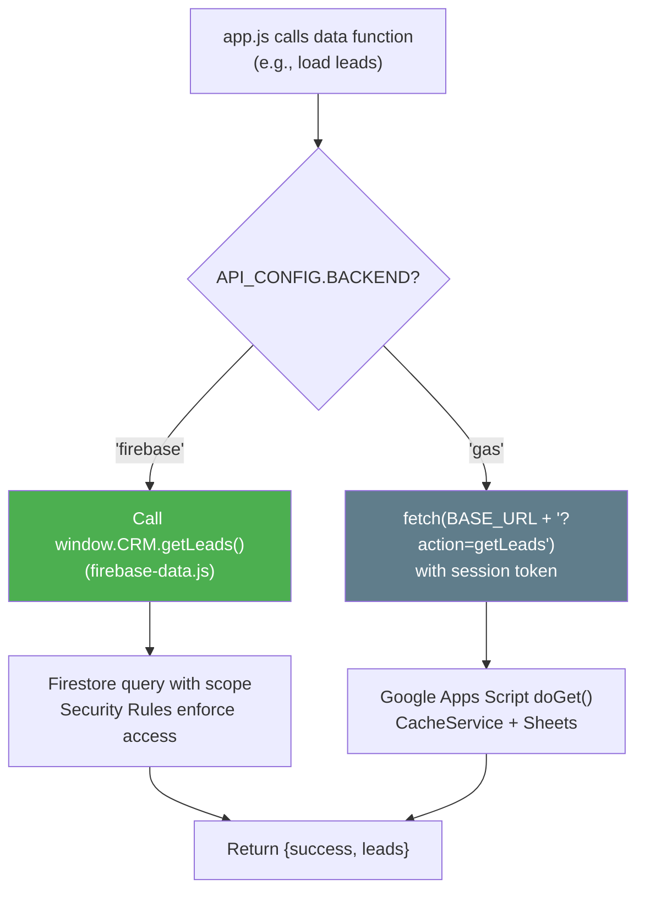

| Aspect / Khía cạnh | Firebase Backend | GAS Backend |
|---|---|---|
| **Data store** | Cloud Firestore (NoSQL) | Google Sheets (tabular) |
| **Auth** | Firebase Auth (scrypt) | Custom session tokens (SHA-256) |
| **Access control** | Security Rules (DB-level) | Code-level in `Code.gs` |
| **Concurrency** | Firestore transactions | `LockService.getScriptLock()` |
| **Caching** | Firestore SDK cache + client `requestCache` | GAS `CacheService` (5 min TTL) |
| **Admin ops** | Cloud Functions (callable) | Direct Sheets manipulation |
| **Scalability** | Thousands of users | ~50 users (Sheets limit) |
| **Cost / Chi phí** | ~0–5 USD/month | Free (0đ) |

---

## 11. DevOps & Tooling / Công Cụ Vận Hành

### 11.1 Migration Tools / Công Cụ Chuyển Dữ Liệu

Located in `tools/` directory. These are **one-time Node.js scripts** run locally with `firebase-admin` SDK:

Nằm trong thư mục `tools/`. Đây là các **script Node.js chạy một lần** trên máy local với `firebase-admin` SDK:

| Script | Purpose / Mục đích |
|---|---|
| `migrate-sheets-to-firestore.js` | Import users & leads from Google Sheets → Firestore. Sets Custom Claims directly (no Cloud Functions needed). / Nhập users & leads từ Google Sheets → Firestore. Gán Custom Claims trực tiếp. |
| `set-unique-passwords.js` | Generate and set unique passwords for each Firebase Auth user. / Tạo và đặt mật khẩu riêng cho từng user Firebase Auth. |
| `import-appointment.js` | Import appointment/meeting data from Excel/CSV. / Nhập dữ liệu cuộc hẹn từ Excel/CSV. |
| `sync-appointment-from-sheet.js` | Sync appointment data from a Google Sheet to Firestore. / Đồng bộ dữ liệu cuộc hẹn từ Google Sheet sang Firestore. |

### 11.2 Data Migration Workflow / Luồng Chuyển Dữ Liệu

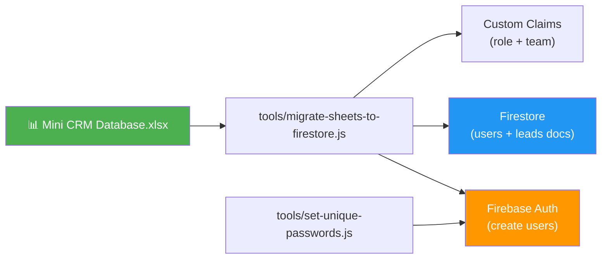

---

## 12. Cost Analysis / Phân Tích Chi Phí

For ~50 users (44 Sale + 5 Manager + 1 Director + 1 Admin):

Cho ~50 người dùng (44 Sale + 5 Manager + 1 Director + 1 Admin):

| Service | Monthly Usage / Sử dụng/tháng | Free Tier / Miễn phí | Estimated Cost / Chi phí ước tính |
|---|---|---|---|
| **Firestore reads** | ~3.5M | 1.5M (50K/day × 30) | ~1.20 USD |
| **Firestore writes** | ~50K | 600K | 0 USD |
| **Firestore storage** | < 0.5 GiB | 1 GiB | 0 USD |
| **Authentication** | 50 MAU | 50,000 MAU | 0 USD |
| **Hosting** | ~3 GB bandwidth | ~10.8 GB | 0 USD |
| **Cloud Functions** | < 0.5M invocations | 2M | 0 USD |
| **TOTAL** | | | **~0–5 USD/month (~0–130,000đ)** |

---

