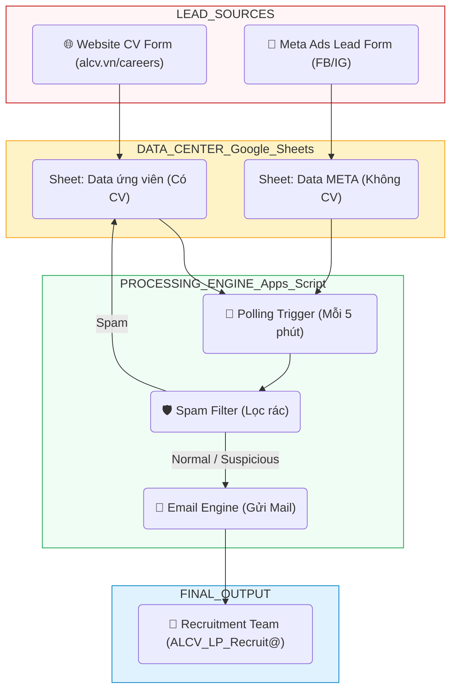
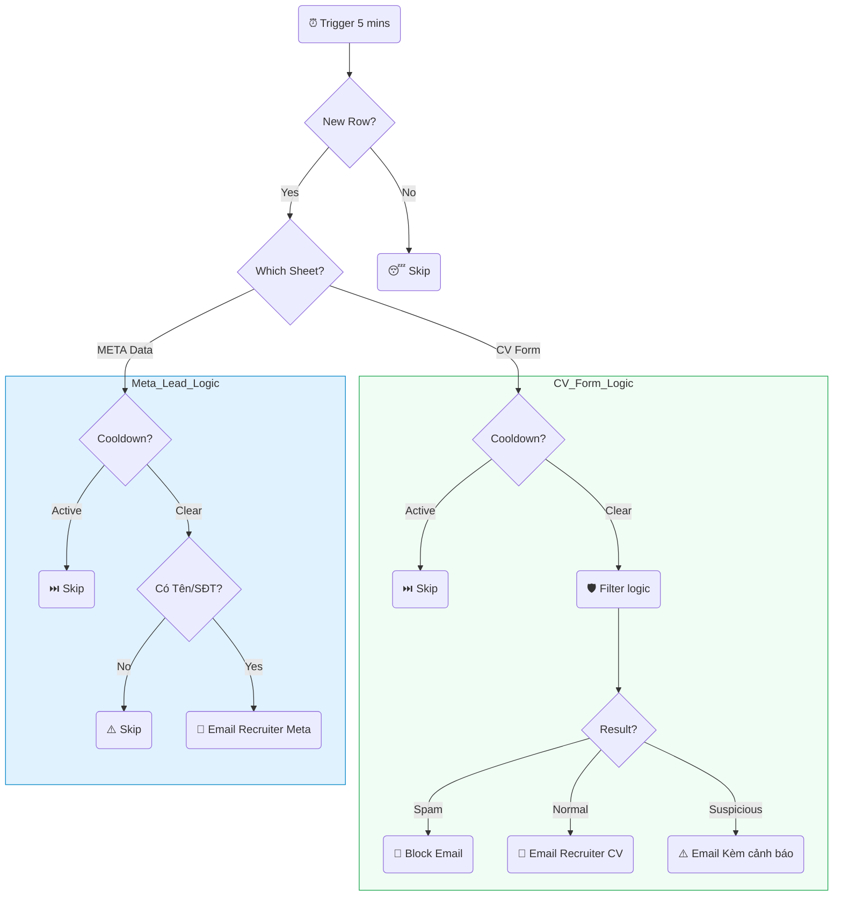
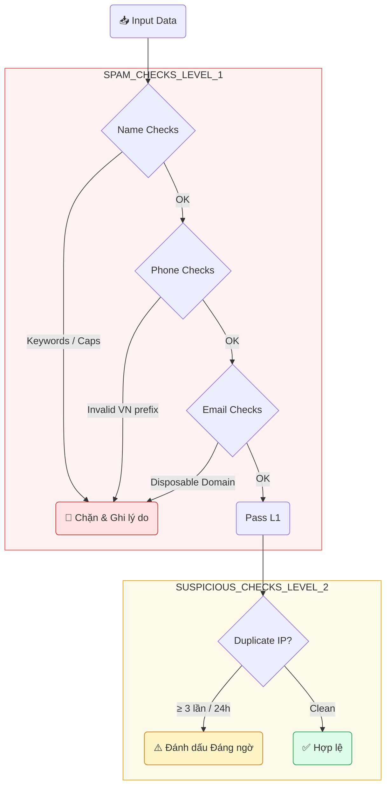
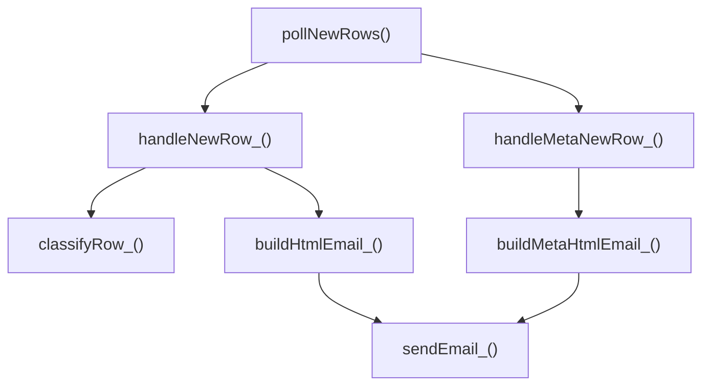

# ALCV Recruitment Notification System v2.0

### System Architecture / Kiến trúc Hệ thống

---

## 1. Executive Summary / Tóm tắt dự án

**[EN]** An automated system that instantly captures candidate data from two main sources (Website CV Form and Meta Ads), filters out spam and invalid leads, and sends real-time email notifications to the recruitment/sales team.

**[VN]** Hệ thống tự động thu thập dữ liệu ứng viên từ 2 nguồn (Website CV Form và Meta Ads), lọc bỏ spam/dữ liệu rác, và gửi thông báo qua email cho đội ngũ tuyển dụng/sales ngay trong thời gian thực. 

---

## 2. System Overview / Tổng quan hệ thống

**[EN]** The high-level flow of how leads enter the system, get processed, and reach the final recipients.
**[VN]** Luồng xử lý tổng quan từ khi có lead mới, qua bộ xử lý, và gửi đến người nhận cuối.

```mermaid
graph TD
    subgraph LEAD_SOURCES
        WEB("🌐 Website CV Form (alcv.vn/careers)")
        META("📱 Meta Ads Lead Form (FB/IG)")
    end

    subgraph DATA_CENTER_Google_Sheets
        S1("Sheet: Data ứng viên (Có CV)")
        S2("Sheet: Data META (Không CV)")
    end

    subgraph PROCESSING_ENGINE_Apps_Script
        POLL("🔄 Polling Trigger (Mỗi 5 phút)")
        FILTER("🛡️ Spam Filter (Lọc rác)")
        NOTIFY("📧 Email Engine (Gửi Mail)")
    end

    subgraph FINAL_OUTPUT
        REC("👥 Recruitment Team (ALCV_LP_Recruit@)")
    end

    WEB --> S1
    META --> S2
  
    S1 --> POLL
    S2 --> POLL
  
    POLL --> FILTER
    FILTER -->|"Normal / Suspicious"| NOTIFY
    FILTER -->|"Spam"| S1
  
    NOTIFY --> REC

    style LEAD_SOURCES fill:#fff5f6,stroke:#C00000
    style DATA_CENTER_Google_Sheets fill:#fef3c7,stroke:#f59e0b
    style PROCESSING_ENGINE_Apps_Script fill:#f0fdf4,stroke:#16a34a
    style FINAL_OUTPUT fill:#e0f2fe,stroke:#0284c7
```

---

## 3. Lead Processing Flow / Luồng Xử lý Dữ liệu chi tiết

**[EN]** Step-by-step logic for how the system handles new entries from different sources.
**[VN]** Logic chi tiết cách hệ thống xử lý dòng dữ liệu mới từ các nguồn để đảm bảo không gửi email trùng lặp. Đã được bố trí theo chiều dọc giúp quan sát luồng chảy trên màn hình nhỏ.

```mermaid
graph TD
    START("⏰ Trigger 5 mins") --> CHECK{"New Row?"}
    CHECK -->|Yes| WHICH{"Which Sheet?"}
    CHECK -->|No| END_SKIP("😴 Skip")

    subgraph CV_Form_Logic
        CV_COOL{"Cooldown?"}
        SKIP1("⏭️ Skip")
        CLASSIFY("🛡️ Filter logic")
        RES{"Result?"}
        LOG_T("🚫 Block Email")
        SEND_CV("📧 Email Recruiter CV")
        SEND_CV_W("⚠️ Email Kèm cảnh báo")
      
        CV_COOL -->|Active| SKIP1
        CV_COOL -->|Clear| CLASSIFY
        CLASSIFY --> RES
        RES -->|"Spam"| LOG_T
        RES -->|"Normal"| SEND_CV
        RES -->|"Suspicious"| SEND_CV_W
    end

    subgraph Meta_Lead_Logic
        META_COOL{"Cooldown?"}
        SKIP2("⏭️ Skip")
        VALID{"Có Tên/SĐT?"}
        SKIP3("⚠️ Skip")
        SEND_META("📧 Email Recruiter Meta")
      
        META_COOL -->|Active| SKIP2
        META_COOL -->|Clear| VALID
        VALID -->|No| SKIP3
        VALID -->|Yes| SEND_META
    end

    WHICH -->|"CV Form"| CV_COOL
    WHICH -->|"META Data"| META_COOL

    style CV_Form_Logic fill:#f0fdf4,stroke:#16a34a
    style Meta_Lead_Logic fill:#e0f2fe,stroke:#0284c7
```

---

## 4. Spam Defense System / Hệ thống Chống Spam (ITCOM-grade)

**[EN]** A robust 3-tier filtering system analyzing Names, Phones, Emails, and IPs.
**[VN]** Hệ thống lọc 3 tầng mạnh mẽ phân tích Tên, SĐT, Email, và IP để chặn phần mềm tự động (bot).

```mermaid
graph TD
    INPUT("📥 Input Data")
    IS_SPAM("🚫 Chặn & Ghi lý do") 
    IS_SUS("⚠️ Đánh dấu Đáng ngờ")
    IS_OK("✅ Hợp lệ")

    subgraph SPAM_CHECKS_LEVEL_1
        N_CHECK{"Name Checks"}
        P_CHECK{"Phone Checks"}
        E_CHECK{"Email Checks"}
        PASS_L1("Pass L1")
      
        N_CHECK -->|"Keywords / Caps"| IS_SPAM
        N_CHECK -->|"OK"| P_CHECK
        P_CHECK -->|"Invalid VN prefix"| IS_SPAM
        P_CHECK -->|"OK"| E_CHECK
        E_CHECK -->|"Disposable Domain"| IS_SPAM
        E_CHECK -->|"OK"| PASS_L1
    end

    subgraph SUSPICIOUS_CHECKS_LEVEL_2
        IP_CHECK{"Duplicate IP?"}
      
        PASS_L1 --> IP_CHECK
        IP_CHECK -->|"≥ 3 lần / 24h"| IS_SUS
        IP_CHECK -->|"Clean"| IS_OK
    end

    INPUT --> N_CHECK

    style SPAM_CHECKS_LEVEL_1 fill:#fef2f2,stroke:#ef4444
    style SUSPICIOUS_CHECKS_LEVEL_2 fill:#fffbeb,stroke:#f59e0b
    style IS_SPAM fill:#fee2e2,stroke:#dc2626
    style IS_SUS fill:#fef3c7,stroke:#d97706
    style IS_OK fill:#dcfce7,stroke:#16a34a
```

---

## 5. Email Notification Templates / Cấu trúc biểu mẫu Email

**[EN]** There are two distinct, branded email templates mapped exactly to the data source so recruiters can digest information instantly.
**[VN]** Thiết kế 2 cấu trúc email riêng biệt tương ứng với nguồn vào, giúp người đọc nắm bắt thông tin theo trọng tâm.

### 5.1. Template Mẫu 1: Nhận CV từ Website

*Mục đích: Mẫu tinh gọn để xem nhanh CV chủ động.*

| Thành phần hiển thị         | Dữ liệu Mapping vào                                                |
| ------------------------------- | --------------------------------------------------------------------- |
| **Tiêu đề (Subject)**  | `[CV MỚI] <Họ Tên> - ALCV Recruitment`                           |
| **Cảnh báo (Nếu có)** | ⚠️ Nếu bộ lọc bắt được tín hiệu `Suspicious` (Trùng IP) |
| **Họ & Tên**            | Tên ứng viên                                                       |
| **Số ĐT / Email**       | SĐT (đã định dạng chuẩn) & Thư điện tử                     |
| **Thời gian nộp**       | `DD/MM/YYYY HH:mm`                                                  |
| **Nút Call-to-Action**   | Kèm link trực tiếp chuyển hướng ấn vào mở Google Drive CV    |

### 5.2. Template Mẫu 2: Meta Lead Form (Không có File CV)

*Mục đích: Mẫu chi tiết hơn vì ứng viên không có CV, kèm sẵn bảng sàng lọc 4 câu hỏi định chuẩn của ALCV.*

| Thành phần hiển thị            | Dữ liệu Mapping vào                                                               |
| ---------------------------------- | ------------------------------------------------------------------------------------ |
| **Tiêu đề (Subject)**     | `[META LEAD] <Họ Tên> - ALCV Recruitment`                                        |
| **Box Lưu ý (Đỏ/Vàng)** | 📌 "Ứng viên đăng ký qua Meta Lead Form, chưa có CV đính kèm"              |
| **Thông tin cá nhân**     | Tên ứng viên / Điện thoại / Email                                              |
| **Trình độ học vấn**    | Cấp bậc cao nhất ứng viên sở hữu (Từ Form Fb/Ig)                             |
| **Câu hỏi Sàng lọc 1**   | Bạn có sẵn sàng làm việc toàn thời gian?`[✅ Có / ❌ Không]`             |
| **Câu hỏi Sàng lọc 2**   | Sẵn sàng tham gia đào tạo tiêu chuẩn Nhật Bản?`[✅ Có / ❌ Không]`      |
| **Câu hỏi Sàng lọc 3**   | Sẵn sàng tuân thủ giờ giấc và nội quy?`[✅ Có / ❌ Không]`               |
| **Câu hỏi Sàng lọc 4**   | Sẵn sàng gặp gỡ, trò chuyện với người lạ?`[✅ Có / ❌ Không]`          |
| **Nguồn gốc (Track)**      | Campaign:`Tên Chiến Dịch` \| Form: `Tên Biểu mẫu` \| Nền tảng: `fb/ig` |

---

## 6. Technical Core / Core Kỹ thuật

**[EN]** Scalable modular functions avoiding race conditions through LockService.
**[VN]** Chống đụng độ tiến trình (Race conditions) bằng LockService, sử dụng MailApp của chính kho Workspace.

```mermaid
graph TD
    pollNewRows["pollNewRows()"]
  
    handleNewRow["handleNewRow_()"]
    handleMetaNewRow["handleMetaNewRow_()"]
  
    classifyRow["classifyRow_()"]
  
    buildHtml["buildHtmlEmail_()"]
    buildMetaHtml["buildMetaHtmlEmail_()"]
  
    sendEmail["sendEmail_()"]

    pollNewRows --> handleNewRow
    pollNewRows --> handleMetaNewRow
  
    handleNewRow --> classifyRow
  
    handleNewRow --> buildHtml
    handleMetaNewRow --> buildMetaHtml
  
    buildHtml --> sendEmail
    buildMetaHtml --> sendEmail
```

---

## 7. Data Privacy & Quotas / Bảo mật & Giới hạn

- **Bảo vệ dữ liệu:** 100% dữ liệu ở lại trong Google Sheets, không thông qua CSDL bên thứ 3 (đảm bảo ITCOM).
- **Email Quota:** Google Workspace tối đa **1,500 emails/ngày**. Khả năng xử lý hơn 300+ leads mỗi ngày mượt mà.
- **Chi phí hạ tầng:** 0đ.
