# Recruit Notify 
> **Purpose**: Automatically send email notifications to the recruitment team when new CV/resume submissions arrive. This script bridges the gap between your recruitment landing page and email inbox, ensuring no candidate is missed.

## 📌 Process Flow

```
┌─────────────────┐     ┌─────────────────┐     ┌─────────────────┐
│  Landing Page   │ ──▶│  Google Sheet   │ ──▶ │ Email Notify    │
│  (Recruit Form) │     │  (Data Storage) │     │ (to HR Team)    │
└─────────────────┘     └─────────────────┘     └─────────────────┘
     Candidate              Auto-sync            Trigger every
     submits CV             via Form             1 hour
```

**How it works:**
1. Candidate submits CV via recruitment landing page
2. Form data automatically syncs to Google Sheet
3. This script polls the sheet every hour and sends email notification for new entries

---

## 📋 Overview

| Item | Value |
|------|-------|
| **Script File** | `cv_notify_recruit.js` |
| **Google Sheet** | Your Google Sheet URL |
| **Sheet Name** | Configurable (default: `Data ứng viên`) |
| **Notification Email** | Configurable in `CONFIG.RECIPIENT_EMAIL` |
| **Polling Interval** | Every 60 minutes (1 hour) |

---

## 📊 Sheet Data Structure

| Column | Name | Description | Required |
|--------|------|-------------|----------|
| A | Timestamp | Submission time | ✅ |
| B | Candidate Name | Full name | ✅ |
| C | Email | Contact email | ❌ |
| D | Phone | Phone number | ✅ |
| E | CV Link | Link to CV file (Google Drive, etc.) | ✅ |

> [!IMPORTANT]
> The script uses **Column B (Name)** as the trigger column. When this column has a value, an email notification will be sent.

---

## ⚙️ Configuration Options

### Change Recipient Email

```javascript
RECIPIENT_EMAIL: 'hr@yourcompany.com',
```

---

### Add CC Emails

```javascript
RECIPIENTS_CC: [
  'manager@yourcompany.com',
  'team-lead@yourcompany.com'
],
```

---

### Customize Spam Filter

```javascript
SPAM_FILTER: {
  ENABLED: true,  // true = enabled, false = disabled
  KEYWORDS: [
    'test', 'demo', 'sample',  // Add keywords to filter
    // ...
  ],
  CHECK_COLUMNS: ['B', 'C', 'D']  // Columns to check
}
```

---

### Change Data Column Mapping

```javascript
DATA_COLS: {
  TIMESTAMP: 'A',
  NAME: 'B',
  EMAIL: 'C',
  PHONE: 'D',
  CV_LINK: 'E'
},
```

---

## 🔧 Control Functions

| Function | Usage | Description |
|----------|-------|-------------|
| `setupTriggers()` | Run once | Create automatic polling trigger |
| `cleanupAllTriggers()` | When reset needed | Delete all triggers and recreate |
| `checkStatus()` | Anytime | Check current script status |
| `enableScript()` | When needed | Enable the script |
| `disableScript()` | When needed | Pause the script |
| `enableDryRun()` | During testing | Only log, don't send emails |
| `disableDryRun()` | After testing | Send real emails |
| `sendTestEmail()` | For testing | Send a sample email |
| `processRow(N)` | Manual processing | Send email for specific row N |
| `resetCooldown(N)` | When resend needed | Reset cooldown for row N |

---

## 📧 Email Template Preview

When a new CV is submitted, the email will look like:

```
Subject: [NEW CV] John Doe - Recruitment Notification

┌─────────────────────────────────────────┐
│  🎯 New Candidate CV                    │
│  Sheet: Data Sheet • Row 15             │
├─────────────────────────────────────────┤
│                                         │
│  CANDIDATE NAME                         │
│  ▌ John Doe                             │
│                                         │
│  ┌──────────────┐ ┌──────────────┐      │
│  │ 📞 Phone     │ │ 📧 Email    │      │
│  │ 0901234567   │ │ john@ex.com  │      │
│  └──────────────┘ └──────────────┘      │
│                                         │
│  ┌─────────────────────────────────┐    │
│  │       CV DOCUMENT               │    │
│  │       📎 View CV (link)         │   │
│  └─────────────────────────────────┘    │
│                                         │
│  ⏰ Submitted: 06/01/2026 17:00         │
│                                         │
└─────────────────────────────────────────┘
```

---

## 🔍 Troubleshooting

### Emails not being sent

1. **Check script is enabled:**
   ```javascript
   // Run checkStatus() to verify
   // If disabled, run enableScript()
   ```

2. **Check trigger exists:**
   - Go to Triggers (⏰) in Apps Script
   - If no trigger exists, run `setupTriggers()`

3. **Check baseline:**
   - Script only processes NEW rows after setup
   - To process old rows: `processRow(row_number)`

4. **Check spam filter:**
   - If name/phone contains spam keywords → skipped
   - Temporarily disable if needed

---

### Duplicate emails

- Script has **5-minute cooldown** per row
- If still getting duplicates, check for multiple triggers
- Run `cleanupAllTriggers()` to reset

---

### Resend email for a specific row

1. Reset cooldown: `resetCooldown(row_number)`
2. Resend: `processRow(row_number)`

---

## 📊 Process Flow

```mermaid
flowchart TD
    A[🕐 Trigger every 60 min] --> B{Script ENABLED?}
    B -->|No| Z[⏸️ Stop]
    B -->|Yes| C[📊 Check target sheet]
    C --> D{New rows?}
    D -->|No| Z
    D -->|Yes| E[📝 Get data from new row]
    E --> F{Spam check}
    F -->|Spam| G[🛡️ Skip this row]
    F -->|OK| H{Cooldown check}
    H -->|Already sent| I[⏭️ Skip - sent recently]
    H -->|OK| J[📧 Send notification email]
    J --> K[✅ Log success]
    K --> L[📍 Update baseline]
```



