# Round Robin Lead Notifier (ZL Auto) - Complete Workflow Documentation

**Version**: ZL Auto (ZL Lead Source)  
**Last Updated**: December 29, 2025  
**Script File**: `round_robin_ZL.js`

---

## 📌 Executive Summary (For Non-Technical Readers)

### What is this system?
This is an **automated lead distribution tool** that helps the sales team receive new customer leads from Zalo (ZL) quickly and fairly.

### How does it work? (Simple explanation)
1. **Customer fills form on Zalo** → Data goes to Google Sheet
2. **System checks every 1 minute** → Detects new leads automatically
3. **Creates unique ID** → Each lead gets code like ZL0001, ZL0002...
4. **Sends email notification** → Sales team (Trans-Cosmos) receives alert immediately
5. **Fair distribution** → Leads are assigned equally among team members (round-robin)

### Business Benefits
| Benefit | Description |
|---------|-------------|
| ⏱️ **Speed** | New leads notified within 1 minute (no manual checking needed) |
| 🎯 **Accuracy** | Auto-generated lead codes prevent duplicates & errors |
| ⚖️ **Fairness** | Round-robin ensures equal lead distribution |
| 🛡️ **Quality** | Spam filter blocks fake/test data automatically |
| 📧 **Visibility** | All stakeholders CC'd on every notification |
| 🔄 **Reliability** | Runs 24/7 without human intervention |

### Who receives the emails?
- **Primary**: Trans-Cosmos data team (handles the leads)
- **CC**: ALCV managers & stakeholders (for visibility)

### Key Numbers
| Metric | Value |
|--------|-------|
| Check frequency | Every 1 minute |
| Duplicate protection | 5 minutes cooldown |
| Spam keywords | 47+ blocked terms |
| Lead code format | ZL0001, ZL0002, ZL0003... |

### Simple Process Flow
```
📱 Zalo Form → 📊 Google Sheet → 🤖 Auto-Detection → 📧 Email Alert → 👥 Sales Team
     ↓              ↓                  ↓                 ↓              ↓
  Customer      Data stored      Within 1 min      With lead ID    Takes action
  submits                        + spam check
```

### Support Contact
For technical issues or changes, contact the development team.

---

## 📋 System Overview

**Purpose**: Automated lead distribution system for ZL (Zalo Lead) data source that monitors Google Sheets for new leads and sends email notifications using a round-robin mechanism.

**Trigger Mechanism**: Time-driven polling (every 1 minute)

**Target Sheets**: Configurable via `CONFIG.SHEET_NAMES` (default: `Lead info`)

**Core Function**: Distribute leads fairly across a pool of recipients using round-robin algorithm

**Key Difference from Standard Version**: 
- Auto-generates Leadcode with format `ZL0001`, `ZL0002`, etc.
- No dedicated Leadcode column in source data
- Simplified data columns (Name: B, Phone: C)
- Single LP recipient configuration

---

## 🎯 Key Features

### ✅ Core Features
1. **Time-based Polling** - Automatic detection of new rows every 1 minute
2. **Round-Robin Distribution** - Fair lead assignment across recipient pool
3. **Multi-sheet Support** - Monitor multiple sheets simultaneously
4. **Duplicate Prevention** - 5-minute cooldown to prevent re-sending
5. **Spam Filter** - Filter out test/invalid leads using keyword detection
6. **Batch Protection** - Prevent mass email sending from bulk imports
7. **Dry Run Mode** - Test without sending real emails
8. **Thread-safe Processing** - Lock mechanism for concurrent execution
9. **Comprehensive Logging** - Detailed console logs with emoji indicators
10. **Email Notifications** - HTML + plain text format with responsive design

### 🆕 ZL-Specific Features
1. **Auto Leadcode Generation** - Automatic `ZL0001`, `ZL0002`... format
2. **Leadcode Counter Persistence** - Counter stored in Properties Service
3. **Simplified Column Mapping** - Only Name (B) and Phone (C) required
4. **Quick Control Functions** - Enable/disable script, set start row, check status
5. **Manual Testing Tools** - Process specific rows, simulate processing
6. **Configuration Validator** - Verify setup before going live
7. **Error Notifications** - Auto-send error alerts to admins

---

## 🔧 Configuration

### CONFIG Object Structure

```javascript
CONFIG = {
  // Master Controls
  ENABLED: true,                    // Master on/off switch
  START_FROM_ROW: null,             // null = auto, or specific row number
  BATCH_PROTECTION: true,           // Prevent bulk email sending
  MAX_BATCH_SIZE: 5,                // Max rows to process at once
  DRY_RUN: false,                   // true = log only, false = send emails
  
  // Email Recipients
  RECIPIENTS_CC: [                  // CC recipients for all emails
    'ledangtrung_hieu@asahi-life.com.vn',
    'vuonghong_ngoc@asahi-life.com.vn',
    'lamphuoc_tuyen@asahi-life.com.vn',
    'nishimura_tomohiko@asahi-life.com.vn',
    'Nguyet.ntm@trans-cosmos.com.vn',
    'hoa.lt@trans-cosmos.com.vn'
  ],
  
  // Lead Pool (Round-robin recipients) - ZL Auto uses single recipient
  LP_POOL: [
    { name: 'Leads mới', email: 'asahi.data@trans-cosmos.com.vn' }
  ],
  
  // Sheet Configuration
  SHEET_NAMES: ['Lead info'],        // Sheets to monitor
  TARGET_COLUMN: 'C',                // Trigger column (Phone)
  MIN_ROW: 2,                        // Start from row 2 (after header)
  MAX_LINES: 50,                     // Max rows per email
  
  // Data Column Mapping (ZL-specific)
  DATA_COLS: {
    NAME: 'B',           // Customer name
    PHONE: 'C',          // Phone number (trigger column)
    COL_D: 'D',          // Used for spam filter
    COL_E: 'E',          // Used for spam filter
    LEADCODE: null,      // NO leadcode column - auto-generated
    COL_H: 'H'           // Used for spam filter
  },
  
  // Leadcode Auto-Generation (ZL-specific)
  LEADCODE_PREFIX: 'ZL',    // Prefix for leadcode
  LEADCODE_DIGITS: 4,       // Number of digits (0001, 0002, ...)
  
  // Spam Filter Configuration
  SPAM_FILTER: {
    ENABLED: true,
    CASE_SENSITIVE: false,
    KEYWORDS: [
      // Test/Demo keywords
      'test', 'demo', 'sample', 'example', 'thử',
      // Spam indicators
      'spam', 'fake', 'giả', 'lừa đảo', 'scam', 'phishing',
      // Invalid placeholders
      'xxx', 'aaa', 'bbb', 'ccc', 'ddd', 'abc',
      '111', '222', '333', '000', '123',
      'invalid', 'null', 'undefined', 'none', 'n/a', 'không hợp lệ', 'trống',
      // Test names
      'nguyen van a', 'tran thi b', 'le van c', 'pham thi d', 
      'không tên', 'chưa có tên',
      // Test phones
      '0000000000', '1111111111', '9999999999', 
      '0123456789', '0987654321', '1234567890',
      // Bot/Automation
      'bot', 'robot', 'automated', 'automation', 'crawler', 'scraper',
      // Profanity (Vietnamese & English)
      'đm', 'dm', 'đcm', 'dcm', 'cc', 'vl', 'vcl', 'clgt', 
      'đéo', 'đ.m', 'lồn', 'buồi', 'cặc', 'địt', 'đụ', 
      'fuck', 'shit', 'bitch',
      // Suspicious
      'hack', 'virus', 'malware', 'exploit', 'admin', 'root', 'system',
      // Marketing spam
      'click here', 'buy now', 'free money', 'make money fast', 
      'winner', 'congratulations', 'you won', 'claim now',
      // Vietnamese spam
      'làm giàu', 'kiếm tiền', 'miễn phí', 'nhận ngay', 'cơ hội vàng'
    ],
    CHECK_COLUMNS: ['B', 'C', 'D', 'E', 'H']
  },
  
  // Email Styling
  EMAIL: {
    brand: 'ALCV Lead Notifier - ZL Auto',
    primary: '#C00000',
    bg: '#f7f7f9',
    text: '#222',
    border: '#e5e7eb'
  }
}
```

---

## 🔄 Main Workflow


---

## 🏗️ Component Architecture


---

## 📊 Data Flow Sequence

```mermaid
sequenceDiagram
    participant Timer as Time Trigger
    participant Poll as pollNewRows
    participant Props as Properties Service
    participant Sheet as Google Sheets
    participant Handler as handleEvent_
    participant Gen as generateLeadcode_
    participant Spam as Spam Filter
    participant RR as Round Robin
    participant Mail as MailApp
    
    Timer->>Poll: Trigger every 1 min
    Poll->>Props: Get lastRow:{sheetId}
    Props-->>Poll: lastDone = X
    
    Poll->>Sheet: getLastRow()
    Sheet-->>Poll: currentRow = Y
    
    alt Y > X (New rows found)
        Poll->>Sheet: Scan rows X+1 to Y
        Sheet-->>Poll: Check target column (C)
        
        loop Each row with data
            Poll->>Handler: Call handleEvent_
            
            Handler->>Gen: generateLeadcode_(sh)
            Gen->>Props: Get counter, increment
            Gen-->>Handler: ZL0001, ZL0002, etc.
            
            Handler->>Spam: isSpamRow_?
            
            alt Spam detected
                Spam-->>Handler: true
                Handler->>Handler: Skip (no cooldown)
            else Clean data
                Spam-->>Handler: false
                Handler->>Props: Check seen:{sheetId}:{row}
                
                alt Sent within 5 min
                    Props-->>Handler: Recent timestamp
                    Handler->>Handler: Skip duplicate
                else Not sent
                    Props-->>Handler: OK to send
                    
                    Handler->>RR: Get next LP (round-robin)
                    RR-->>Handler: LP assigned
                    
                    Handler->>Props: Set cooldown timestamp
                    Handler->>Handler: Build HTML + text email
                    
                    alt DRY_RUN = true
                        Handler->>Handler: Log only
                    else DRY_RUN = false
                        Handler->>Mail: sendEmail()
                        Mail-->>Handler: Email sent ✓
                    end
                    
                    Handler->>Props: Increment LP index
                end
            end
        end
        
        Poll->>Props: Update lastRow = Y
    else No new rows
        Poll->>Poll: Log: No changes
    end
```



---

## 🎮 Quick Control Functions

### Script Control
```javascript
// Enable/disable entire script
enableScript();                     // ✅ Turn ON
disableScript();                    // ❌ Turn OFF
checkStatus();                      // 📊 Check current status
```

### Row Processing Control
```javascript
// Set starting row
setStartRow(100);                   // Start from row 100
setStartRow('auto');                // Auto mode (from last row)
resetToAuto();                      // Reset to auto mode
```

### Protection Controls
```javascript
// Batch protection
enableBatchProtection();            // 🛡️ ON (default)
disableBatchProtection();           // ⚠️ OFF (allow bulk)
setMaxBatchSize(10);                // Set max batch size
```

### Testing Controls
```javascript
// Dry run mode
enableDryRun();                     // 🧪 Log only, no emails
disableDryRun();                    // 📧 Send real emails
```

### Spam Filter Controls
```javascript
// Spam filter
enableSpamFilter();                 // 🛡️ Filter enabled
disableSpamFilter();                // ⚠️ Filter disabled
```

---

## 🧪 Manual Testing Functions

### 1. Process Specific Rows
```javascript
// Process single row
processSpecificRows(100);

// Process multiple rows
processSpecificRows([100, 101, 102]);
```

**Use case**: Test specific rows without waiting for trigger

---

### 2. Process All Pending Rows
```javascript
processAllPendingRows();
```

**Use case**: Manually process all rows with data in target column

---

### 3. Simulate Processing
```javascript
simulate(2);         // Simulate processing row 2
simulate(100);       // Simulate processing row 100
```

**Use case**: Test processing logic for a specific row

---

### 4. Send Test Email
```javascript
sendTest();
```

**Output**: Sends test email with dummy data:
- Row: 999
- Name: "Nguyễn Văn Test"
- Phone: "0901234567"
- Leadcode: "ZL0001" (auto-generated format)

---

### 5. Validate Configuration
```javascript
validateConfig();
```

**Checks**:
- ✅ All configured sheets exist
- ✅ Column headers are correct
- ✅ LP_POOL is valid
- ✅ Email quota remaining
- ✅ Data columns have proper values
- ℹ️ Leadcode auto-generation format info
- ⚠️ Warnings for potential issues

---

### 6. Health Check
```javascript
healthcheck();
```

**Output**: Sheet existence, email quota remaining

---

## 🛠️ Setup Functions

### 1. Setup Triggers
```javascript
setupTriggers();
```

**Creates**:
- Time-driven trigger: `pollNewRows` (every 1 minute)
- Initializes poll baseline

**Note**: Run once during initial setup

---

### 2. Initialize Poll Baseline
```javascript
initPollBaseline();
```

**Purpose**: Set the starting point for row tracking to prevent sending historical data

**Called by**: `setupTriggers()` automatically

---

## 🆕 Auto Leadcode Generation (ZL-Specific)

### Configuration
```javascript
LEADCODE_PREFIX: 'ZL',    // Prefix for leadcode
LEADCODE_DIGITS: 4,       // Number of digits (0001, 0002, ...)
```

### How It Works
1. **Counter Storage**: Uses `PropertiesService.getDocumentProperties()`
2. **Key Format**: `leadcodeCounter:{sheetId}`
3. **Generation Process**:
   - Get current counter value
   - Increment counter
   - Format: `{PREFIX}{PADDED_NUMBER}` → `ZL0001`, `ZL0002`, etc.
   - Save new counter value

### Example Output
| Counter | Generated Leadcode |
|---------|-------------------|
| 1 | ZL0001 |
| 2 | ZL0002 |
| 10 | ZL0010 |
| 100 | ZL0100 |
| 1000 | ZL1000 |
| 10000 | ZL10000 |

---

## 🛡️ Spam Filter

### Configuration
```javascript
SPAM_FILTER: {
  ENABLED: true,
  CASE_SENSITIVE: false,
  KEYWORDS: [...],                   // 47+ keywords
  CHECK_COLUMNS: ['B', 'C', 'D', 'E', 'H']
}
```

### Keyword Categories
| Category | Examples | Count |
|----------|----------|-------|
| Test/Demo | test, demo, sample, example, thử | 5 |
| Spam/Fake | spam, fake, giả, lừa đảo, scam, phishing | 6 |
| Invalid Placeholders | xxx, aaa, invalid, null, n/a | 12 |
| Test Names | nguyen van a, tran thi b | 6 |
| Test Phones | 0000000000, 1111111111, 0123456789 | 6 |
| Bot/Automation | bot, robot, automated, crawler | 6 |
| Profanity (VN+EN) | đm, dm, fuck, shit, bitch | 18 |
| Suspicious | hack, virus, malware, admin | 7 |
| Marketing Spam | click here, buy now, winner | 8 |
| Vietnamese Spam | làm giàu, kiếm tiền, miễn phí | 5 |

**Total**: 47+ keywords

### Detection Logic
1. Check if `SPAM_FILTER.ENABLED` is true
2. Read values from columns B, C, D, E, H
3. Convert to lowercase (if not case-sensitive)
4. Check if any value contains any keyword
5. Return `true` if spam detected

### Critical Feature
- **No cooldown set for spam rows** - Allows retry after data correction
- Spam rows are logged but not marked as "seen"

---

## 🔒 Safety Features

### 1. Duplicate Prevention
- **Mechanism**: Timestamp in Properties Service
- **Key**: `seen:{sheetId}:{rowNum}`
- **Window**: 5 minutes (300,000 ms)
- **Purpose**: Prevent re-sending emails for same row

---

### 2. Batch Protection
- **Mechanism**: `MAX_BATCH_SIZE` limit
- **Default**: 5 rows
- **Purpose**: Prevent mass emails from bulk paste operations
- **Control**: `enableBatchProtection()` / `disableBatchProtection()`

---

### 3. Thread Safety
- **Mechanism**: `LockService.getDocumentLock()`
- **Timeout**: 30 seconds
- **Scope**: Document-level
- **Purpose**: Prevent race conditions in round-robin assignment

---

### 4. Validation Chain
Each row must pass:
1. ✅ Sheet exists and is monitored
2. ✅ Row >= MIN_ROW (default: 2)
3. ✅ Target column (C) has data
4. ✅ Not spam (keyword check)
5. ✅ Not sent recently (cooldown check)

---

### 5. Error Handling
- Try-catch blocks in all major functions
- Console logging with emoji indicators
- Error notification emails to admins
- Graceful degradation (skip failed rows, continue processing)

---

## 📧 Email Format

### Email Structure (Table Format)
```
┌──────────────────────────────────────────────────────┐
│  ALCV | Lead mới / 新規リード                        │
│  Sheet: Lead info • Cột: C                           │
├──────────────────────────────────────────────────────┤
│  #     │ Họ tên / お名前  │ SĐT / 電話  │ Leadcode  │
├──────────────────────────────────────────────────────┤
│  2(C2) │ Nguyễn Văn A     │ 0901234567  │ ZL0001    │
│  3(C3) │ Trần Thị B       │ 0912345678  │ ZL0002    │
├──────────────────────────────────────────────────────┤
│  Noted: LP Name <lp@email.com> • Phân bổ round-robin │
└──────────────────────────────────────────────────────┘
```

### Email Features
- **HTML + Plain text**: Both formats included
- **Responsive design**: Works on mobile and desktop
- **Bilingual**: Vietnamese + Japanese headers
- **Auto-generated leadcode**: Displayed in each row
- **Zebra striping**: Alternating row colors

### Email Components
| Component | Purpose |
|-----------|---------|
| Header Block | Brand, sheet name, trigger column |
| Table Header | Column labels (bilingual) |
| Lead Rows | Row number, name, phone, leadcode |
| LP Note | Assigned recipient info |

---

## 📊 Data Column Mapping

### Sheet Structure (ZL Auto)
| Column | Letter | Purpose | Required |
|--------|--------|---------|----------|
| Name | B | Customer name | ✅ Yes |
| Phone | C | Phone number (trigger) | ✅ Yes |
| Col D | D | Additional data | For spam filter |
| Col E | E | Additional data | For spam filter |
| Col H | H | Additional data | For spam filter |

**Note**: Leadcode is NOT in the sheet - auto-generated by script

### Trigger Logic
- **Trigger Column**: C (Phone)
- **Condition**: New data in column C triggers processing
- **Mode**: `NOTIFY_MODE: 'new'` - Only triggers on empty → filled transition

---

## 🗂️ State Management

### Properties Service Keys
| Key Pattern | Purpose | Example |
|-------------|---------|---------|
| `lastRow:{sheetId}` | Last processed row | `lastRow:12345: 50` |
| `seen:{sheetId}:{row}` | Cooldown timestamp | `seen:12345:50: 1703836800000` |
| `lpIdx:{sheetId}` | Current LP index | `lpIdx:12345: 2` |
| `leadcodeCounter:{sheetId}` | Auto leadcode counter | `leadcodeCounter:12345: 15` |

### State Lifecycle
1. **Initial**: `setupTriggers()` → Sets `lastRow` to current last row
2. **Poll**: Check if new rows exist beyond `lastRow`
3. **Process**: Set `seen` timestamp, increment `lpIdx`, increment `leadcodeCounter`
4. **Complete**: Update `lastRow` to current position

---

## 📝 Usage Scenarios

### Scenario 1: Initial Setup
```javascript
// 1. Configure CONFIG object
// Edit CONFIG.LP_POOL, CONFIG.RECIPIENTS_CC, etc.

// 2. Setup triggers
setupTriggers();

// 3. Validate configuration
validateConfig();

// 4. Test with dry run
enableDryRun();
sendTest();

// 5. Check logs, then go live
disableDryRun();
enableScript();
```

---

### Scenario 2: New Lead Added (ZL Auto)
**Timeline**:
```
T+0s   : User adds row 50 with phone number in column C
T+60s  : pollNewRows() triggers
T+61s  : Row detected, leadcode generated (ZL0015)
T+62s  : Spam check passed
T+63s  : LP assigned via round-robin
T+64s  : Email sent with auto-generated leadcode
T+65s  : State updated (lastRow=50, counter=15, cooldown set)
T+120s : Next poll (no new rows)
```

---

### Scenario 3: Spam Detected
**Flow**:
```
Row 51: Name = "test", Phone = "123456789"
↓
Spam filter checks columns B, C, D, E, H
↓
Keyword "test" found in column B
↓
Row skipped, NO cooldown set
↓
Leadcode NOT consumed (counter not incremented)
↓
User can fix data and retry
```

**Key**: No cooldown for spam = allows correction and reprocessing

---

### Scenario 4: Duplicate Request
**Flow**:
```
Row 52: Phone = "0901234567"
↓
Leadcode generated: ZL0016
Email sent at T+0s
↓
Cooldown set: seen:{sheetId}:52 = timestamp
↓
Manual re-trigger at T+60s
↓
Cooldown check: (now - timestamp) < 5 min
↓
Row skipped (duplicate protection)
Leadcode NOT re-consumed
```

---

### Scenario 5: Troubleshooting
**Problem**: New rows not processing

**Debug steps**:
```javascript
// 1. Check script status
checkStatus();
// Output: ✅ Script ON, starting row: auto

// 2. Check configuration
validateConfig();
// Check for errors/warnings

// 3. Check specific row
simulate(47);
// Check logs for processing details

// 4. If needed, process manually
processSpecificRows([46, 47, 48]);
```

---

## 🚀 Best Practices

### 1. Initial Setup
- ✅ Run `setupTriggers()` once
- ✅ Run `validateConfig()` to verify
- ✅ Use `enableDryRun()` for testing
- ✅ Test with `sendTest()` before going live

### 2. Production Use
- ✅ Keep `CONFIG.ENABLED = true`
- ✅ Keep `CONFIG.DRY_RUN = false`
- ✅ Keep `CONFIG.SPAM_FILTER.ENABLED = true`
- ✅ Monitor email quota regularly

### 3. Maintenance
- ✅ Periodically run `checkStatus()`
- ✅ Check execution logs for errors
- ✅ Keep LP_POOL updated
- ✅ Review and update spam keywords

### 4. Troubleshooting
- ✅ Use `validateConfig()` for setup issues
- ✅ Use `simulate()` to test specific rows
- ✅ Check Properties Service for state issues
- ✅ Monitor console logs for emoji indicators

---

## 🎯 Function Reference

### Core Functions
| Function | Purpose | Auto-run |
|----------|---------|----------|
| `pollNewRows()` | Main polling function | ✅ Every 1 min |
| `handleEvent_(e, sourceType)` | Process individual row | Called by poll |
| `isSpamRow_(sh, rowNum)` | Check spam keywords | Called by handler |
| `generateLeadcode_(sh)` | Auto-generate ZL leadcode | Called by handler |

### Setup Functions
| Function | Purpose | Run Once |
|----------|---------|----------|
| `setupTriggers()` | Create time-driven trigger | ✅ Yes |
| `initPollBaseline()` | Set starting point | ✅ Yes |

### Control Functions
| Function | Purpose | Manual |
|----------|---------|--------|
| `enableScript()` | Turn ON script | ✅ Manual |
| `disableScript()` | Turn OFF script | ✅ Manual |
| `checkStatus()` | Check current state | ✅ Manual |
| `setStartRow(n)` | Set starting row | ✅ Manual |
| `resetToAuto()` | Reset to auto mode | ✅ Manual |
| `enableDryRun()` | Enable test mode | ✅ Manual |
| `disableDryRun()` | Disable test mode | ✅ Manual |
| `enableSpamFilter()` | Enable spam filter | ✅ Manual |
| `disableSpamFilter()` | Disable spam filter | ✅ Manual |
| `enableBatchProtection()` | Enable batch limit | ✅ Manual |
| `disableBatchProtection()` | Disable batch limit | ✅ Manual |
| `setMaxBatchSize(n)` | Set max batch size | ✅ Manual |

### Testing Functions
| Function | Purpose | Manual |
|----------|---------|--------|
| `processSpecificRows(rows)` | Process specific rows | ✅ Manual |
| `processAllPendingRows()` | Process all pending | ✅ Manual |
| `simulate(row)` | Simulate processing | ✅ Manual |
| `sendTest()` | Send test email | ✅ Manual |
| `validateConfig()` | Validate setup | ✅ Manual |
| `healthcheck()` | Check health | ✅ Manual |

### Email Builders
| Function | Purpose | Internal |
|----------|---------|----------|
| `buildHtmlEmail_()` | Build HTML email | ✅ Internal |
| `buildTextEmail_()` | Build plain text | ✅ Internal |
| `renderLeadRows_()` | Render lead rows | ✅ Internal |
| `renderHeaderBlock_()` | Render header | ✅ Internal |
| `renderTableHeader_()` | Render table header | ✅ Internal |
| `renderLpNote_()` | Render LP note | ✅ Internal |

### Utilities
| Function | Purpose | Internal |
|----------|---------|----------|
| `letterToCol_(s)` | Convert column letter to number | ✅ Internal |
| `isFilled(v)` | Check if value is filled | ✅ Internal |
| `safeStr(v)` | Safe string conversion | ✅ Internal |
| `escapeHtml_(s)` | Escape HTML entities | ✅ Internal |
| `isValidEmail(email)` | Validate email format | ✅ Internal |
| `getUiTheme_()` | Get email theme | ✅ Internal |

---

## 📚 Glossary

| Term | Definition |
|------|------------|
| **Round-robin** | Fair distribution algorithm that cycles through recipients |
| **LP** | Lead recipient (team/person receiving leads) |
| **ZL** | Zalo Lead - Lead source identifier |
| **Trigger Column** | Column that triggers processing when filled (Column C) |
| **Leadcode** | Auto-generated unique identifier (ZL0001, ZL0002...) |
| **Cooldown** | Time window preventing duplicate sends (5 minutes) |
| **Dry Run** | Test mode that logs without sending emails |
| **Spam Filter** | Keyword-based filter to block test/invalid data |
| **Batch Protection** | Feature preventing mass email sends |
| **Properties Service** | Google Apps Script persistent storage |
| **Poll/Polling** | Periodic checking for new data |

---

## 🔗 Quick Reference

### Common Commands
```javascript
// Check status
checkStatus();

// Test without sending
enableDryRun();
simulate(2);
disableDryRun();

// Process specific rows
processSpecificRows([10, 11, 12]);

// Validate setup
validateConfig();
```

### Console Log Icons
| Icon | Meaning |
|------|---------|
| ✅ | Success/Enabled |
| ❌ | Error/Disabled |
| ⚠️ | Warning |
| 📧 | Email related |
| 📊 | Data/Statistics |
| 📍 | Position/Row |
| 🛡️ | Protection/Filter |
| 🧪 | Testing/Dry run |
| ⏭️ | Skipped |
| 🔧 | Manual processing |
| ℹ️ | Information |

---

## 📋 Version History

| Version | Date | Changes |
|---------|------|---------|
| ZL Auto v1.0 | Dec 19, 2025 | Initial ZL-specific version |
| ZL Auto v1.1 | Dec 29, 2025 | Documentation created |

---

**Document Created**: December 29, 2025  
**Author**: ALCV Development Team  
**Script Location**: `round_robin_ZL.js`
